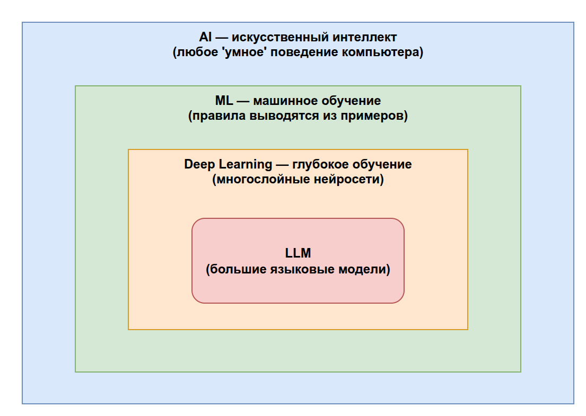
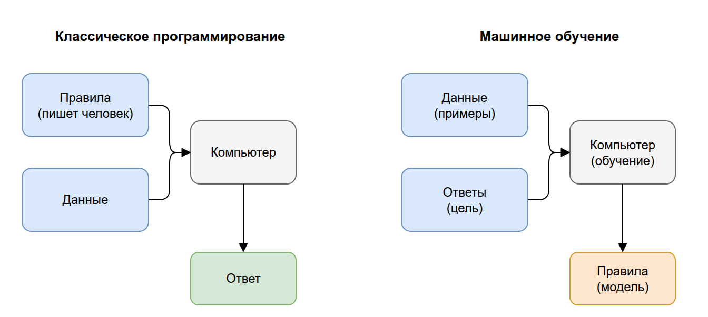
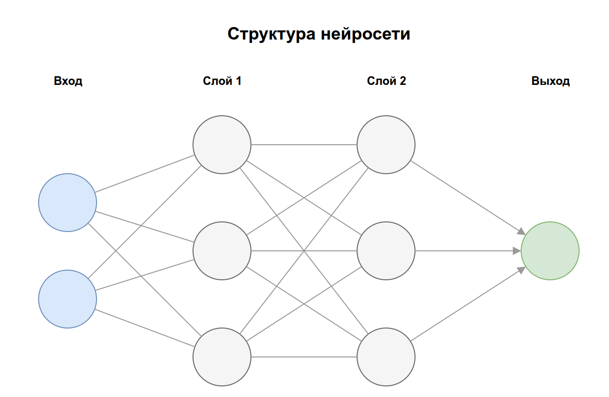
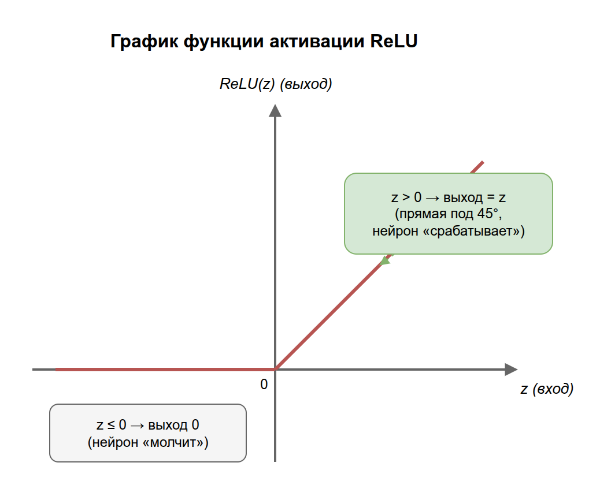
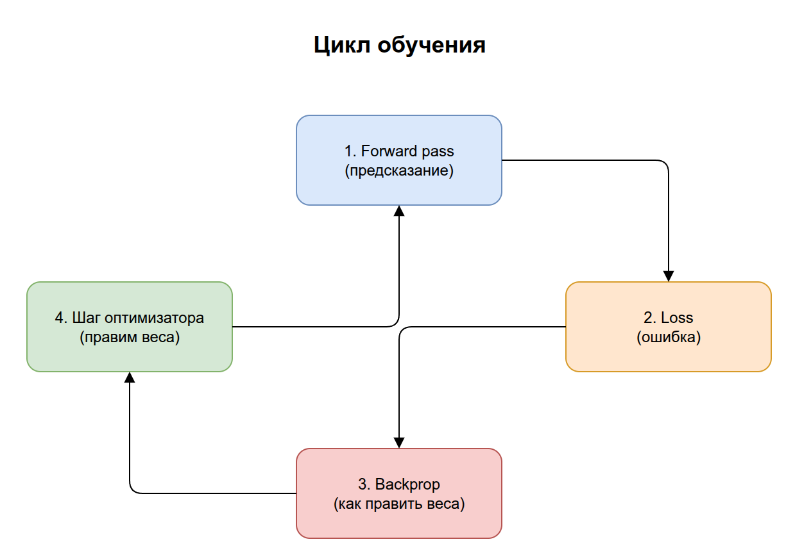
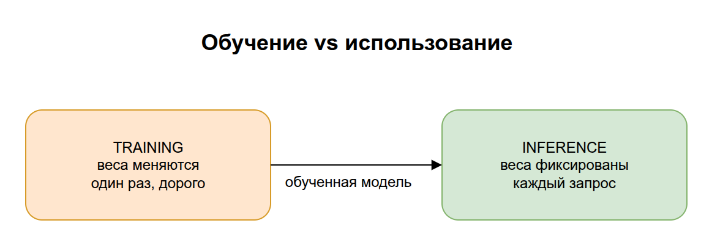

# 01. Основы: AI, ML и нейросети

Это фундамент всей базы знаний. Здесь нет ни LLM, ни агентов — только базовые понятия, без которых всё остальное превратится в набор магических слов. Цель раздела: чтобы к концу вы понимали фразу «модель — это функция с обучаемыми параметрами, которую настроили на данных».

## Содержание

1. [AI, ML и Deep Learning — кто кому родственник](#1-ai-ml-и-deep-learning)
2. [Что такое «модель»](#2-что-такое-модель)
3. [Нейросеть простыми словами](#3-нейросеть-простыми-словами)
4. [Что значит «обучить» модель](#4-что-значит-обучить-модель)
5. [Inference: использование обученной модели](#5-inference-использование-обученной-модели)
6. [Ключевые термины раздела](#6-ключевые-термины-раздела)

---

## 1. AI, ML и Deep Learning

Эти три слова часто путают. На самом деле это вложенные понятия, как матрёшки.

**AI (Artificial Intelligence, искусственный интеллект)** — самое широкое понятие. Это любая попытка заставить компьютер делать то, что мы считаем «умным»: играть в шахматы, распознавать лица, переводить текст. Сюда входят даже системы на жёстких правилах вида «если ..., то ...».

**ML (Machine Learning, машинное обучение)** — подмножество AI. Главная идея: вместо того чтобы вручную прописывать правила, мы показываем компьютеру **примеры**, и он сам выводит закономерности. Программист не пишет «кот — это животное с усами и хвостом», а даёт 10 000 фотографий котов и говорит «вот это коты».

**Deep Learning (глубокое обучение)** — подмножество ML, основанное на **нейросетях** с большим числом слоёв («глубоких»). Именно отсюда выросли все современные LLM.

> Аналогия: AI — это «транспорт» вообще. ML — это «автомобили». Deep Learning — это «электромобили». Каждое следующее — частный, более конкретный случай предыдущего.



> Исходник диаграммы: [`diagrams/01-ai-ml-dl.drawio`](../diagrams/01-ai-ml-dl.drawio)

### Классический подход vs машинное обучение

Разница принципиальная — её стоит прочувствовать:

| | Классическое программирование | Машинное обучение |
|---|---|---|
| Что пишет человек | Правила (алгоритм) | Примеры (данные) + цель |
| Что выдаёт компьютер | Ответ | Правила (модель) |
| Пример | «Налог = доход × 0.13» | «Вот 100 000 деклараций, научись предсказывать налог» |



> Исходник диаграммы: [`diagrams/01-rules-vs-ml.drawio`](../diagrams/01-rules-vs-ml.drawio)

---

## 2. Что такое «модель»

**Модель** — это математическая функция, которая принимает на вход данные и выдаёт результат. Самый простой пример из школы:

```
y = w * x + b
```

Здесь `x` — вход, `y` — выход, а `w` и `b` — **параметры** (их ещё называют **весами**, *weights*). Если подобрать правильные `w` и `b`, эта функция сможет, например, предсказывать цену квартиры (`y`) по её площади (`x`).

Современная нейросеть — это та же идея, только параметров не два, а **миллиарды**, и функция намного сложнее. GPT-класса модели имеют сотни миллиардов параметров.

> Ключевая мысль: **модель = функция + набор чисел-параметров**. «Обучить модель» = «подобрать эти числа так, чтобы функция давала правильные ответы».

> На практике: когда вы скачиваете модель (например, файл на несколько гигабайт), вы скачиваете именно эти подобранные числа-параметры. Архитектура (форма функции) — это код, а веса — это данные.

---

## 3. Нейросеть простыми словами

**Нейросеть (нейронная сеть)** — это способ построить очень гибкую функцию из множества простых элементов — **нейронов**.

Один **нейрон** делает три вещи:
1. Берёт несколько чисел на вход.
2. Умножает каждое на свой вес и складывает (плюс смещение `b`). Получается одно число — назовём его `z`.
3. Пропускает `z` через **функцию активации** и выдаёт итоговое число дальше.

Подробнее про третий шаг — ниже, потому что именно он чаще всего вызывает вопросы.

Нейроны объединяются в **слои**. Выход одного слоя становится входом следующего. Много слоёв → «глубокая» сеть → Deep Learning.

```
Вход  →  [Слой 1]  →  [Слой 2]  →  ...  →  [Слой N]  →  Выход
         нейроны     нейроны              нейроны
```



> Исходник диаграммы: [`diagrams/01-neural-network.drawio`](../diagrams/01-neural-network.drawio)

> Аналогия: представьте конвейер фабрики. Сырьё (вход) проходит через цеха (слои). Каждый цех немного преобразует деталь. На выходе — готовый продукт (предсказание). «Обучение» — это настройка станков в каждом цехе.

### Функция активации: что это и как работает

**Функция активации** — это маленькая функция, которая стоит на выходе каждого нейрона и решает, какое число он передаст дальше. На вход она получает результат сложения (`z` из шага 2), на выход выдаёт «обработанное» число.

Зачем вообще что-то «обрабатывать»? Чтобы понять, разберём самую популярную активацию — **ReLU**.

#### Пример: ReLU

ReLU (Rectified Linear Unit) — это правило простое до смешного:

```
ReLU(z) = z,  если z > 0
ReLU(z) = 0,  если z ≤ 0
```

То есть: **отрицательные числа превращаются в ноль, положительные проходят как есть.** Несколько примеров:

| Вход `z` | ReLU(z) |
|----------|---------|
| 5        | 5       |
| 0.3      | 0.3     |
| 0        | 0       |
| −2       | 0       |
| −100     | 0       |

На графике это выглядит как «излом» в нуле: слева от нуля линия лежит на оси (выход 0), справа — идёт вверх под 45° (выход равен входу).



> Исходник диаграммы: [`diagrams/01-relu.drawio`](../diagrams/01-relu.drawio)

> Интуиция: нейрон как бы спрашивает «достаточно ли сильный сигнал, чтобы я сработал?». Если сумма получилась отрицательной — нейрон «молчит» (выдаёт 0). Если положительной — «срабатывает» и передаёт сигнал дальше. Это похоже на то, как настоящий нейрон в мозге либо возбуждается, либо нет.

Есть и другие активации с похожей ролью, но разной формой:
- **sigmoid** — плавно «сжимает» любое число в диапазон от 0 до 1 (удобно, когда нужна «вероятность»);
- **tanh** — сжимает в диапазон от −1 до 1.

Конкретный выбор не так важен на старте; важно понять их общую задачу.

#### Почему без неё сеть не работает

Ключевое слово — **нелинейность**. Шаги 1–2 нейрона (умножить на веса и сложить) — это линейная операция, она умеет описывать только прямые линии. А функция активации «изгибает» эту прямую.

Что будет, если активацию убрать? Каждый слой станет линейным, и тогда есть математический факт: **сто линейных слоёв подряд сворачиваются в один линейный слой** — обычную прямую `y = w*x + b`. Сеть из 100 слоёв стала бы не умнее одного, и умела бы рисовать только прямые.

> Аналогия: представьте, что вы складываете лист бумаги. Линейные слои — это только сдвиги и растяжения листа, лист остаётся плоским. Функция активации — это **сгиб**. Много сгибов подряд позволяют сложить из плоского листа сколь угодно сложную фигуру. Без сгибов (без активации) сколько слой ни добавляй — лист останется плоским.

Именно поэтому функция активации — не мелкая деталь, а причина, по которой глубокие сети вообще способны учить сложные зависимости (распознавать лица, понимать текст и т.д.).

---

## 4. Что значит «обучить» модель

Обучение (**training**) — это процесс автоматического подбора параметров (весов), чтобы модель давала правильные ответы. Происходит это циклом:

1. **Прямой проход (forward pass):** подаём пример на вход, модель выдаёт предсказание.
2. **Функция потерь (loss):** сравниваем предсказание с правильным ответом и вычисляем число — насколько модель ошиблась. Чем больше ошибка, тем больше loss.
3. **Обратное распространение (backpropagation):** математически вычисляем, как нужно чуть-чуть подправить каждый вес, чтобы ошибка уменьшилась.
4. **Шаг оптимизации:** немного двигаем веса в нужную сторону (этим занимается **оптимизатор**, например градиентный спуск).
5. Повторяем миллионы раз на множестве примеров.



> Исходник диаграммы: [`diagrams/01-training-loop.drawio`](../diagrams/01-training-loop.drawio)

> Аналогия: вы учитесь бросать дротики в мишень с завязанными глазами. Бросок (forward pass) → вам говорят «на 10 см левее» (loss) → вы корректируете руку (backpropagation + шаг). Через тысячи бросков вы попадаете в цель.

### Важные термины обучения

- **Датасет (dataset)** — набор примеров, на которых учится модель.
- **Эпоха (epoch)** — один полный проход по всему датасету.
- **Градиентный спуск (gradient descent)** — метод, который подсказывает направление, куда двигать веса.
- **Learning rate (скорость обучения)** — насколько большой шаг делаем за раз. Слишком большой — «перепрыгнём» решение, слишком маленький — учимся вечность.
- **Переобучение (overfitting)** — модель «вызубрила» тренировочные примеры наизусть, но плохо работает на новых данных. Главный враг ML.

---

## 5. Inference: использование обученной модели

**Inference (инференс)** — это применение уже обученной модели для получения ответа. Обучение делается **один раз** (долго и дорого), а inference — **каждый раз**, когда вы пользуетесь моделью.

| | Training (обучение) | Inference (использование) |
|---|---|---|
| Когда | Один раз, заранее | Каждый запрос пользователя |
| Что происходит с весами | Меняются | Не меняются (только читаются) |
| Стоимость | Очень высокая (дни/недели на GPU-кластере) | Относительно низкая (один прогон) |
| Пример | Тренировка GPT | Ваш чат с ChatGPT |

> На практике: когда говорят «модель дорого хостить», обычно имеют в виду стоимость inference — каждый запрос пользователя требует прогнать миллиарды параметров. А «обучение модели стоило миллионы» — это про training.



> Исходник диаграммы: [`diagrams/01-training-vs-inference.drawio`](../diagrams/01-training-vs-inference.drawio)

---

## 6. Ключевые термины раздела

| Термин | Короткое определение | Примеры |
|--------|----------------------|---------|
| **AI** | Любая попытка сделать компьютер «умным» | Шахматный движок, голосовой ассистент, ChatGPT |
| **ML** | Подход, где компьютер выводит правила из примеров, а не получает их от человека | Фильтр спама, рекомендации фильмов |
| **Deep Learning** | ML на основе глубоких (многослойных) нейросетей | Распознавание лиц, перевод текста, LLM |
| **Модель** | Функция с обучаемыми параметрами | Линейная регрессия, GPT-4o, ResNet |
| **Параметры / веса** | Числа внутри модели, которые подбираются при обучении | У GPT-3 — 175 млрд весов |
| **Нейросеть** | Гибкая функция из множества нейронов, организованных в слои | CNN для картинок, Transformer для текста |
| **Нейрон** | Простой вычислительный элемент: взвешенная сумма + активация | `y = activation(w1·x1 + w2·x2 + b)` |
| **Слой** | Группа нейронов; сети состоят из последовательности слоёв | Входной, скрытые, выходной слой |
| **Функция активации** | Нелинейность, дающая сети способность учить сложные зависимости | ReLU, sigmoid, tanh |
| **Training** | Процесс подбора весов на данных | Обучение на размеченных фото кошек/собак |
| **Loss** | Мера ошибки модели | MSE (регрессия), cross-entropy (классификация) |
| **Backpropagation** | Алгоритм вычисления, как подправить веса | Используется в каждом шаге обучения сети |
| **Inference** | Использование обученной модели для предсказания | ChatGPT отвечает на ваш вопрос |
| **Overfitting** | Модель «зазубрила» данные и плохо обобщает | 100% на обучении, 60% на новых данных |

---

## 7. Опросник для самопроверки

Ответьте своими словами (вслух или письменно), не подсматривая. Рядом с каждым вопросом — что перечитать, если ответ не даётся. В конце — как трактовать результат.

### Уровень 1. Понимание определений

1. Чем отличаются AI, ML и Deep Learning? Какое понятие самое широкое? → [§1](#1-ai-ml-и-deep-learning)
2. В чём разница классического программирования и ML: что пишет человек и что выдаёт компьютер в каждом случае? → [§1](#1-ai-ml-и-deep-learning)
3. Закончите фразу: «Модель — это ...». Что такое параметры (веса)? → [§2](#2-что-такое-модель)
4. Какие три вещи делает один нейрон с входными числами? → [§3](#3-нейросеть-простыми-словами)
5. Что такое inference и чем он отличается от обучения? → [§5](#5-inference-использование-обученной-модели)

### Уровень 2. Связи между понятиями

6. Зачем нужна функция активации? Что станет с сетью из 100 слоёв, если её убрать? → [§3](#почему-нужна-нелинейность-функция-активации)
7. Опишите цикл обучения из 4 шагов (forward pass → loss → backprop → шаг оптимизатора): что происходит на каждом? → [§4](#4-что-значит-обучить-модель)
8. Почему обучение делают один раз, а inference — на каждый запрос? Какой этап дороже и почему? → [§5](#5-inference-использование-обученной-модели)
9. Что такое overfitting и почему это плохо? → [§4](#важные-термины-обучения)

### Уровень 3. Применение

10. У вас файл модели на 4 ГБ. Что физически в нём лежит — код или числа? Почему? → [§2](#2-что-такое-модель)
11. Модель отлично отвечает на обучающих примерах, но ошибается на новых. Как называется проблема и на каком этапе она возникла? → [§4](#важные-термины-обучения)
12. Менеджер говорит «модель дорого хостить». Про какой этап — training или inference — он скорее всего говорит? → [§5](#5-inference-использование-обученной-модели)

### Как оценить результат

- **10–12 уверенных ответов** → основа усвоена, переходите к разделу 02.
- **6–9** → перечитайте подразделы по ссылкам к «проваленным» вопросам, особенно §3 (нейросеть) и §4 (обучение).
- **Меньше 6** → перечитайте весь раздел не спеша, опираясь на блоки `> Аналогия:`. Без этого фундамента LLM будет даваться тяжело.

> Что «подтянуть» по темам: вопросы 1–2 → карта AI/ML/DL; 3–5, 10 → природа модели и весов; 6–7, 9, 11 → механика обучения; 8, 12 → разница training/inference.

---

**Дальше:** [02. Большие языковые модели (LLM) →](../02-llm/README.md)

Теперь, когда вы понимаете, что модель — это обучаемая функция, можно разобрать самый важный её вид для нашей темы: большие языковые модели.
