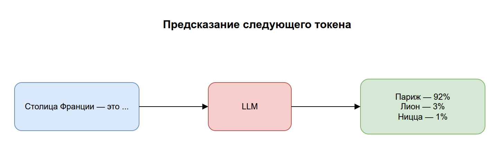
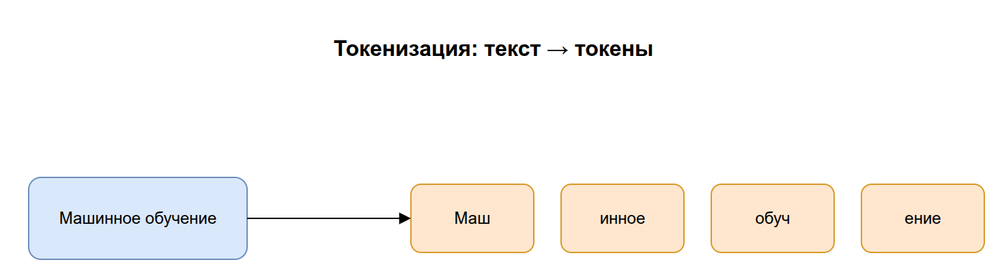
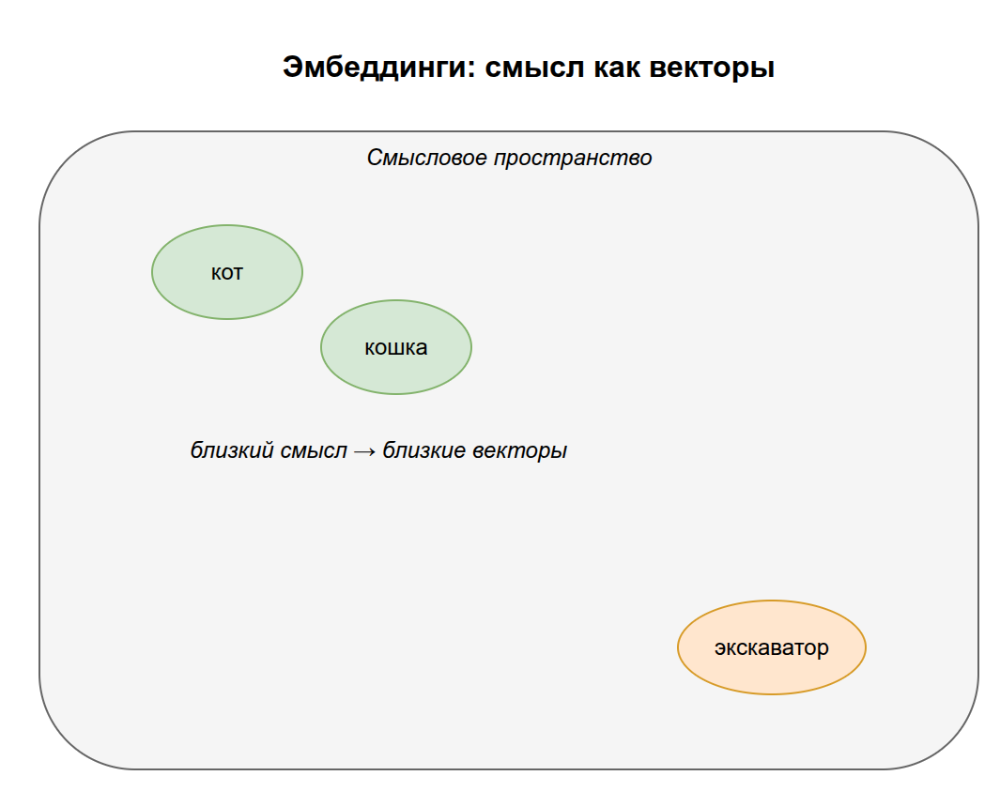
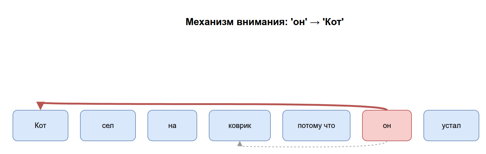
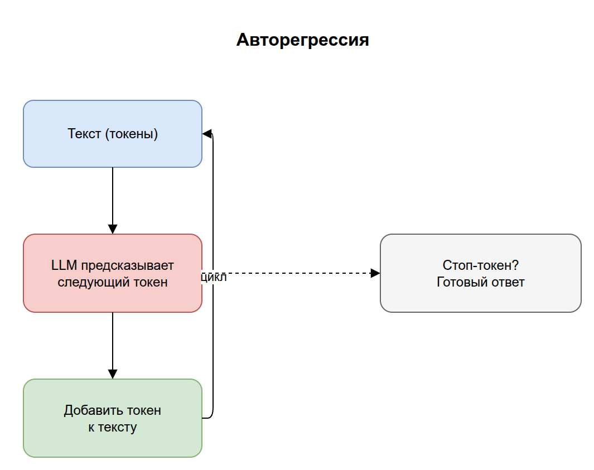
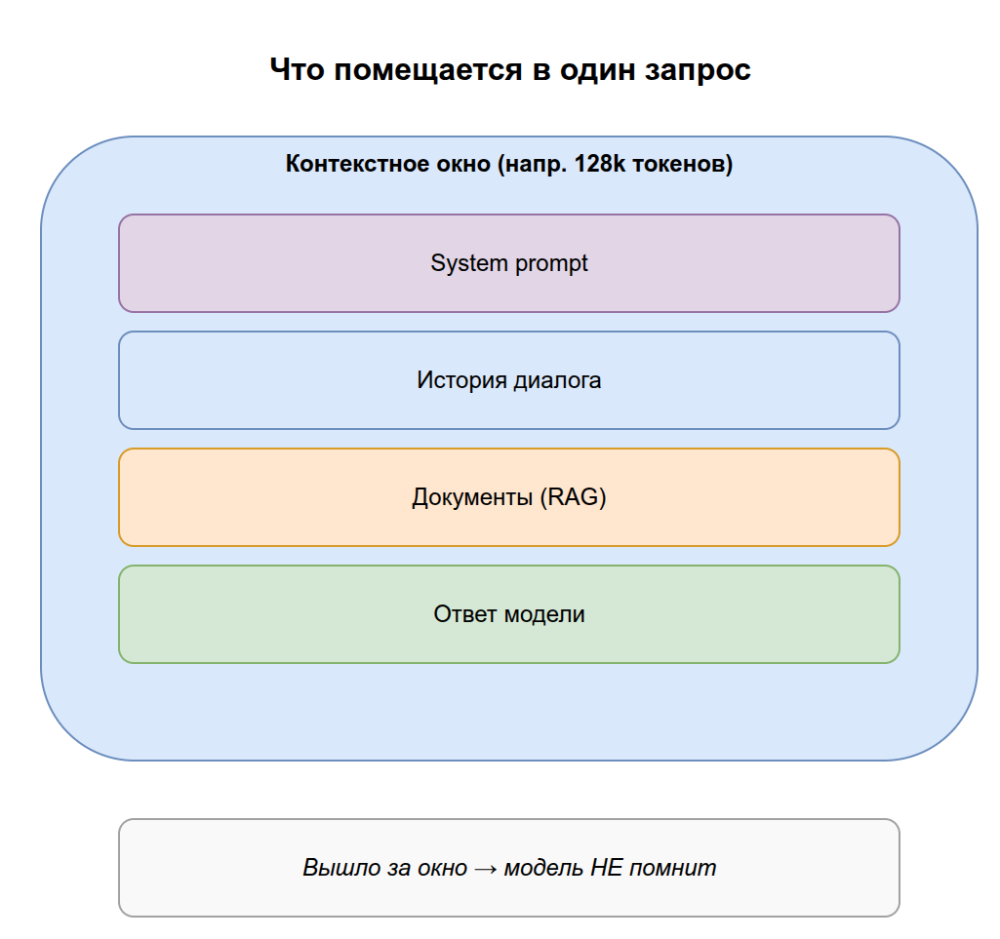
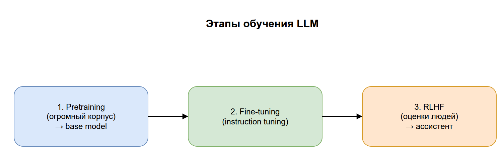
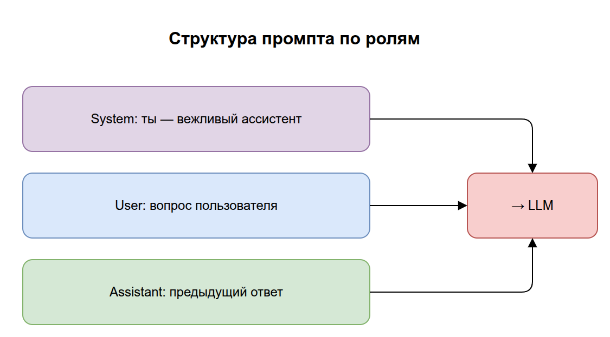

# 02. Большие языковые модели (LLM)

В прошлом разделе мы выяснили, что модель — это обучаемая функция. Теперь разберём её самый важный для нас вид — **LLM (Large Language Model, большая языковая модель)**. Это «мозг» всех чат-ботов, агентов и RAG-систем, о которых пойдёт речь дальше.

Цель раздела: понять, что LLM по сути делает только одно — **предсказывает следующий кусочек текста** — и как из этой простой механики вырастают связные ответы.

## Содержание

1. [Что такое LLM в одном предложении](#1-что-такое-llm-в-одном-предложении)
2. [Токены: на чём «думает» модель](#2-токены)
3. [Embeddings: текст как числа](#3-embeddings-текст-как-числа)
4. [Трансформер и механизм внимания](#4-трансформер-и-механизм-внимания)
5. [Как LLM генерирует ответ](#5-как-llm-генерирует-ответ)
6. [Контекстное окно](#6-контекстное-окно)
7. [Как обучают LLM: pretraining и fine-tuning](#7-как-обучают-llm)
8. [Промпт и его части](#8-промпт-и-его-части)
9. [Галлюцинации и ограничения](#9-галлюцинации-и-ограничения)
10. [Ключевые термины раздела](#10-ключевые-термины-раздела)

---

## 1. Что такое LLM в одном предложении

**LLM — это нейросеть, обученная предсказывать следующий токен (кусочек текста) на основе предыдущих.**

Звучит скромно, но именно из этой задачи «угадай продолжение» рождается способность отвечать на вопросы, писать код и рассуждать. Модель, которая по-настоящему хорошо предсказывает продолжение текста, вынуждена была «понять» грамматику, факты, логику и стиль — иначе предсказания были бы плохими.

> Аналогия: представьте человека, который прочитал почти весь интернет и натренировался в игре «угадай следующее слово». Спросите его «Столица Франции — это...», и он уверенно продолжит «Париж», потому что в текстах это сочетание встречалось миллионы раз.



> Исходник диаграммы: [`diagrams/02-next-token.drawio`](../diagrams/02-next-token.drawio)

---

## 2. Токены

Модель не работает с буквами или словами напрямую. Текст сначала разбивается на **токены** — кусочки слов. Этим занимается **токенизатор**.

Например, фраза `"Машинное обучение"` может разбиться на токены вроде:
```
["Маш", "инное", " обуч", "ение"]
```

```python
text: str = "Машинное обучение"
tokens: list[str] = ["Маш", "инное", " обуч", "ение"]

print(len(text), "символов →", len(tokens), "токена")  # 17 символов → 4 токена
```

Один токен — это примерно ¾ слова в английском (в русском чуть меньше из-за особенностей кодировки). Это важно знать по двум причинам:

1. **Лимиты и цена считаются в токенах**, а не в словах или символах. «Контекст 128k» означает 128 000 токенов.
2. Модель видит мир именно в токенах — поэтому иногда «спотыкается» на подсчёте букв в слове: она просто не видит отдельных букв.

> На практике: при работе с API вы платите за input-токены (ваш запрос) и output-токены (ответ модели) отдельно. Длинные документы = много токенов = дороже.



> Исходник диаграммы: [`diagrams/02-tokenization.drawio`](../diagrams/02-tokenization.drawio)

---

## 3. Embeddings: текст как числа

Нейросеть умеет работать только с числами, а не со словами. **Embedding (эмбеддинг, векторное представление)** — это способ превратить токен (или целый текст) в **вектор** — список из сотен или тысяч чисел.

Главное свойство хорошего embedding: **близкие по смыслу тексты получают близкие векторы**. Слова «кот» и «кошка» окажутся рядом в этом многомерном пространстве, а «кот» и «экскаватор» — далеко.

```
"кот"        → [0.21, -0.04, 0.88, ...]   ┐
"кошка"      → [0.19, -0.02, 0.85, ...]   ┘ рядом (похожий смысл)
"экскаватор" → [-0.71, 0.55, 0.10, ...]     далеко (другой смысл)
```

«Близость» векторов измеряют **косинусным сходством**: чем ближе результат к 1, тем ближе смысл.

```python
import numpy as np


def cos_sim(a: np.ndarray, b: np.ndarray) -> float:
    return float(np.dot(a, b) / (np.linalg.norm(a) * np.linalg.norm(b)))


cat: np.ndarray = np.array([0.21, -0.04, 0.88])        # "кот"
kitten: np.ndarray = np.array([0.19, -0.02, 0.85])     # "кошка"
excavator: np.ndarray = np.array([-0.71, 0.55, 0.10])  # "экскаватор"

print(cos_sim(cat, kitten))     # ≈ 1.0  — близко по смыслу
print(cos_sim(cat, excavator))  # ≈ -0.1 — далеко по смыслу
```

> Аналогия: представьте карту, где каждое слово — точка. Слова со схожим смыслом стоят в одном «районе города». Embedding — это координаты слова на этой смысловой карте.

Embeddings — критически важное понятие: на них держится весь **RAG** (раздел 04), потому что они позволяют искать тексты «по смыслу», а не по точному совпадению слов.



> Исходник диаграммы: [`diagrams/02-embeddings.drawio`](../diagrams/02-embeddings.drawio)

> Разница, которую часто путают: *embedding токена внутри LLM* и *embedding текста для поиска* — родственные идеи, но используются для разного. Подробнее о поисковых embeddings — в [разделе 04](../04-rag/README.md).

---

## 4. Трансформер и механизм внимания

Современные LLM построены на архитектуре **Transformer (трансформер)**, представленной Google в 2017 году (статья «Attention Is All You Need»). Это та самая «форма функции», о которой говорилось в разделе 01.

Ключевая идея трансформера — **механизм внимания (attention)**. При обработке каждого токена модель «смотрит» на все остальные токены в тексте и решает, какие из них важны для понимания текущего.

> Пример: в предложении «Кот сел на коврик, потому что **он** устал» механизм внимания помогает модели понять, что «он» относится к «коту», а не к «коврику».

> Аналогия: читая детектив, вы держите в голове все улики сразу и при появлении новой подсказки мысленно связываете её с нужными уликами из прошлых глав. Attention делает то же самое со словами.

Почему это было прорывом: предыдущие архитектуры обрабатывали текст строго по очереди и «забывали» далёкое начало. Трансформер видит весь контекст сразу и хорошо распараллеливается на GPU — поэтому модели удалось масштабировать до миллиардов параметров.



> Исходник диаграммы: [`diagrams/02-attention.drawio`](../diagrams/02-attention.drawio)

---

## 5. Как LLM генерирует ответ

Генерация ответа — это цикл предсказания токенов **по одному**:

1. Модель получает весь текст (ваш промпт) в виде токенов.
2. Предсказывает **распределение вероятностей** следующего токена (например: «Париж» — 92%, «Лион» — 3%, ...).
3. Выбирает один токен (с учётом настроек случайности).
4. Добавляет его к тексту и **повторяет** с пункта 1 — теперь уже с новым токеном на конце.
5. Останавливается, когда сгенерирует специальный токен конца или достигнет лимита.

```python
# Иллюстративный псевдокод генерации
tokens: list[str] = prompt_tokens
while not is_end(tokens):
    probs = model(tokens)       # распределение вероятностей след. токена
    tokens.append(pick(probs))  # выбрали один → дописали в конец
```

Этот процесс называется **авторегрессией** — модель кормит саму себя своими же предсказаниями.



> Исходник диаграммы: [`diagrams/02-generation-loop.drawio`](../diagrams/02-generation-loop.drawio)

### Temperature и выбор токена

- **Temperature (температура)** — параметр случайности. При `0` модель всегда берёт самый вероятный токен (предсказуемо, но скучно). При высокой температуре чаще выбирает менее вероятные варианты (креативнее, но рискует «уплыть»).
- **Top-p / Top-k** — другие способы ограничить выбор разумными вариантами.

> На практике: для фактических задач (извлечение данных, код) ставят низкую температуру. Для творческих (генерация идей, текстов) — выше.

---

## 6. Контекстное окно

**Контекстное окно (context window)** — это максимальное число токенов, которое модель может «держать в голове» за один запрос. Сюда входит и ваш промпт, и генерируемый ответ.

- Если контекст 8k токенов, а вы подали документ на 10k — часть просто не поместится.
- Всё, что вышло за окно, модель **не помнит**. У LLM нет встроенной долгой памяти между запросами — каждый запрос она видит «с чистого листа», кроме того, что вы сами положили в контекст.

> Это ключевое ограничение, которое порождает целые направления: **RAG** (раздел 04) появился именно для того, чтобы подкладывать в контекст только нужные кусочки знаний, а не весь массив данных.



> Исходник диаграммы: [`diagrams/02-context-window.drawio`](../diagrams/02-context-window.drawio)

---

## 7. Как обучают LLM

Обучение LLM обычно идёт в два-три этапа:

1. **Pretraining (предобучение).** Модель читает гигантский корпус текстов (книги, интернет, код) и учится единственной задаче — предсказывать следующий токен. Это самый дорогой этап (миллионы долларов, недели на тысячах GPU). Результат — **базовая модель (base model)**, эрудированная, но «дикая»: она просто продолжает текст, а не выполняет инструкции.

2. **Fine-tuning (дообучение).** Базовую модель дообучают на более узких данных. Частный случай — **instruction tuning**: модель учат следовать инструкциям и вести диалог.

3. **RLHF (Reinforcement Learning from Human Feedback).** Люди оценивают ответы модели, и она дообучается давать ответы, которые людям нравятся (полезные, безопасные, вежливые). Так base model превращается в удобного ассистента.



> Исходник диаграммы: [`diagrams/02-training-stages.drawio`](../diagrams/02-training-stages.drawio)

> Важное различие: **fine-tuning меняет веса модели** (нужны данные, вычисления, время). А вот **промптинг и RAG не меняют веса** — они лишь умно подбирают вход. Поэтому RAG обычно дешевле и быстрее, чем дообучение, для добавления новых знаний.

---

## 8. Промпт и его части

**Промпт (prompt)** — это весь текст, который вы подаёте модели на вход. В чат-моделях он обычно структурирован по **ролям**:

- **System (системный промпт)** — задаёт поведение и правила: «Ты — вежливый ассистент-юрист, отвечай кратко».
- **User** — сообщение пользователя.
- **Assistant** — предыдущие ответы модели (для поддержания диалога).

На практике этот промпт по ролям — это список сообщений, который уходит в API модели:

```python
messages: list[dict] = [
    {"role": "system", "content": "Ты — вежливый ассистент-юрист, отвечай кратко."},
    {"role": "user", "content": "Что такое договор оферты?"},
]
```

**Промпт-инжиниринг** — искусство формулировать промпт так, чтобы получить нужный результат. Базовые приёмы:

- **Few-shot** — дать в промпте несколько примеров «вход → выход», чтобы показать формат.
- **Chain-of-Thought (CoT)** — попросить модель «рассуждать пошагово», что улучшает решение сложных задач.
- **Tree of Thoughts (ToT)** — развитие CoT: вместо одной линейной цепочки модель исследует **несколько веток** рассуждения и выбирает лучшую. Дороже (много прогонов), зато сильнее на задачах с перебором вариантов — головоломки, планирование.

> Аналогия: CoT — это идти к решению по одной тропинке; Tree of Thoughts — на развилках пробовать несколько тропинок и возвращаться, если завела в тупик.



> Исходник диаграммы: [`diagrams/02-prompt-roles.drawio`](../diagrams/02-prompt-roles.drawio)

---

## 9. Галлюцинации и ограничения

**Галлюцинация (hallucination)** — когда модель уверенно выдаёт правдоподобную, но **ложную** информацию (несуществующая книга, выдуманный API-метод, неверная дата).

Почему так происходит: модель не хранит факты как базу данных — она предсказывает *правдоподобное продолжение*. Иногда самое правдоподобное по форме оказывается неверным по сути.

Главные ограничения LLM, которые важно держать в голове:

- **Знания заморожены** на момент обучения (knowledge cutoff) — модель не знает свежих событий.
- **Нет доступа к вашим приватным данным** — она не видела вашу базу клиентов.
- **Ограниченный контекст** — нельзя «впихнуть» сколь угодно много информации.
- **Нет действий во внешнем мире** — сама по себе модель только генерирует текст.

Каждое из этих ограничений лечится отдельным инструментом, которые мы разберём дальше:
- свежие/приватные знания → **RAG** (раздел 04);
- действия во внешнем мире → **агенты и инструменты** (раздел 03).

---

## 10. Ключевые термины раздела

| Термин | Короткое определение | Примеры |
|--------|----------------------|---------|
| **LLM** | Нейросеть, предсказывающая следующий токен текста | GPT-4o, Claude, Gemini, DeepSeek, Llama |
| **Токен** | Кусочек текста — единица, которой оперирует модель | «привет» ≈ 1 токен, «токенизация» ≈ 3 токена |
| **Токенизатор** | Компонент, разбивающий текст на токены | tiktoken (OpenAI), SentencePiece |
| **Embedding** | Представление текста в виде вектора чисел; близкий смысл → близкие векторы | `text-embedding-3` (OpenAI), модели BGE, E5 |
| **Transformer** | Архитектура нейросети, на которой построены LLM | GPT, BERT, T5 |
| **Attention** | Механизм, позволяющий учитывать связи между всеми токенами | Связывает «он» с нужным существительным в тексте |
| **Авторегрессия** | Генерация ответа по одному токену, подавая вывод обратно на вход | «Сегодня» → «Сегодня хорошая» → «Сегодня хорошая погода» |
| **Temperature** | Параметр случайности при выборе токена | 0 — строгий код, 0.7 — текст, 1.2 — креатив |
| **Контекстное окно** | Максимум токенов, которые модель учитывает за один запрос | GPT-4o — 128K, Claude — 200K токенов |
| **Pretraining** | Базовое обучение на огромном корпусе текстов | Обучение GPT на текстах из интернета |
| **Fine-tuning** | Дообучение под конкретную задачу (меняет веса) | Модель под юридические документы компании |
| **RLHF** | Дообучение по человеческим оценкам ответов | Так из GPT-3 сделали ChatGPT |
| **Промпт** | Весь входной текст для модели | «Переведи на английский: привет» |
| **Промпт-инжиниринг** | Искусство составления эффективных промптов | Few-shot примеры, «думай шаг за шагом» |
| **Галлюцинация** | Уверенно выданная ложная информация | Выдуманная книга с несуществующим автором |
| **Knowledge cutoff** | Дата, на которой «заморожены» знания модели | Модель не знает событий после даты обучения |

---

## 11. Опросник для самопроверки

Отвечайте своими словами, не подсматривая. Ссылки — куда вернуться, если ответ не даётся.

### Уровень 1. Понимание определений

1. Какую единственную задачу решает LLM на самом низком уровне? → [§1](#1-что-такое-llm-в-одном-предложении)
2. Что такое токен и кто разбивает текст на токены? → [§2](#2-токены)
3. Что такое embedding и каким главным свойством он обладает (про близость по смыслу)? → [§3](#3-embeddings-текст-как-числа)
4. Что такое контекстное окно и что входит в его лимит? → [§6](#6-контекстное-окно)
5. Что такое галлюцинация и почему она вообще возникает? → [§9](#9-галлюцинации-и-ограничения)

### Уровень 2. Связи между понятиями

6. Что делает механизм внимания (attention) и почему он стал прорывом по сравнению с прошлыми архитектурами? → [§4](#4-трансформер-и-механизм-внимания)
7. Опишите цикл генерации ответа (авторегрессию). Почему модель пишет «по одному токену»? → [§5](#5-как-llm-генерирует-ответ)
8. Как temperature влияет на ответ? Какую поставите для извлечения данных, а какую для генерации идей? → [§5](#temperature-и-выбор-токена)
9. Чем отличаются три этапа обучения (pretraining, fine-tuning, RLHF)? Что выдаёт каждый? → [§7](#7-как-обучают-llm)
10. Какие части бывают у промпта по ролям и за что отвечает system-роль? → [§8](#8-промпт-и-его-части)

### Уровень 3. Применение

11. Пользователь жалуется: «модель не знает событий этого месяца». Какое ограничение сработало и как его называют? → [§9](#9-галлюцинации-и-ограничения)
12. Вам нужно, чтобы модель отвечала строго в заданном формате JSON. Какой приём из промпт-инжиниринга примените в первую очередь? → [§8](#8-промпт-и-его-части)
13. Почему RAG (раздел 04) дешевле, чем fine-tuning, когда надо просто добавить свежие знания? Что меняет каждый из подходов? → [§7](#7-как-обучают-llm)
14. Документ на 200 000 токенов, а контекст модели — 128k. Что произойдёт и какой инструмент решит проблему? → [§6](#6-контекстное-окно)

### Как оценить результат

- **12–14 уверенных ответов** → отлично, переходите к разделу 03.
- **7–11** → повторите §4 (attention), §5 (генерация) и §7 (этапы обучения) — это ядро понимания LLM.
- **Меньше 7** → перечитайте раздел; если плывут токены/embeddings (§2–§3), вернитесь к ним отдельно — на них держатся разделы 03 и 04.

> Что «подтянуть» по темам: 1–2 → токены и предсказание; 3 → embeddings (нужно для RAG); 6–7 → устройство трансформера; 8 → параметры генерации; 9, 11, 13–14 → ограничения LLM и обходные пути; 10, 12 → промптинг.

---

**Назад:** [← 01. Основы](../01-foundations/README.md) &nbsp;|&nbsp; **Дальше:** [03. ИИ-агенты и протоколы →](../03-agents/README.md)

«Голая» LLM умеет только генерировать текст и ограничена своим контекстом. Следующий шаг — дать ей руки и инструменты. Так появляются агенты.
