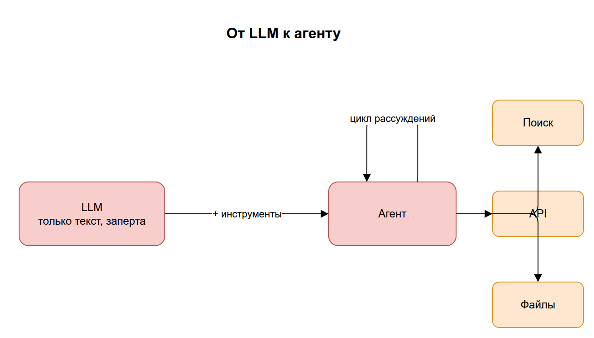
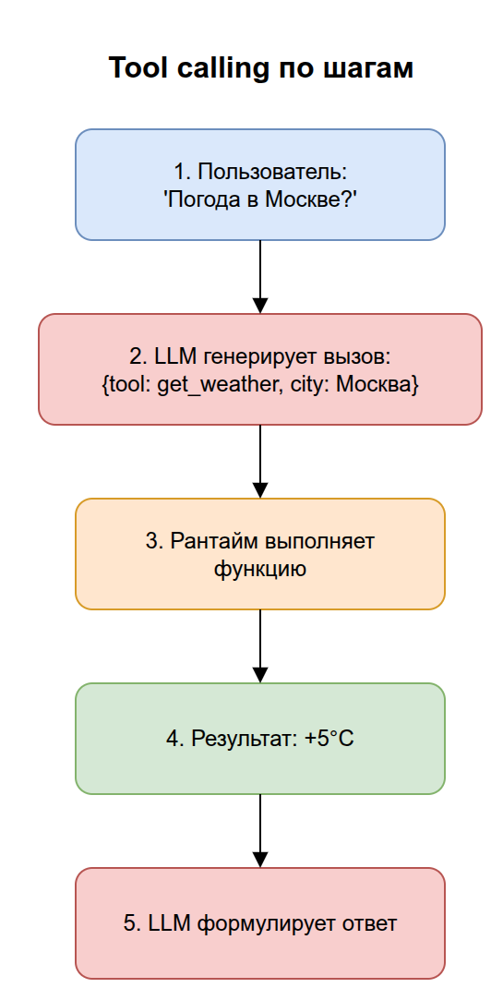
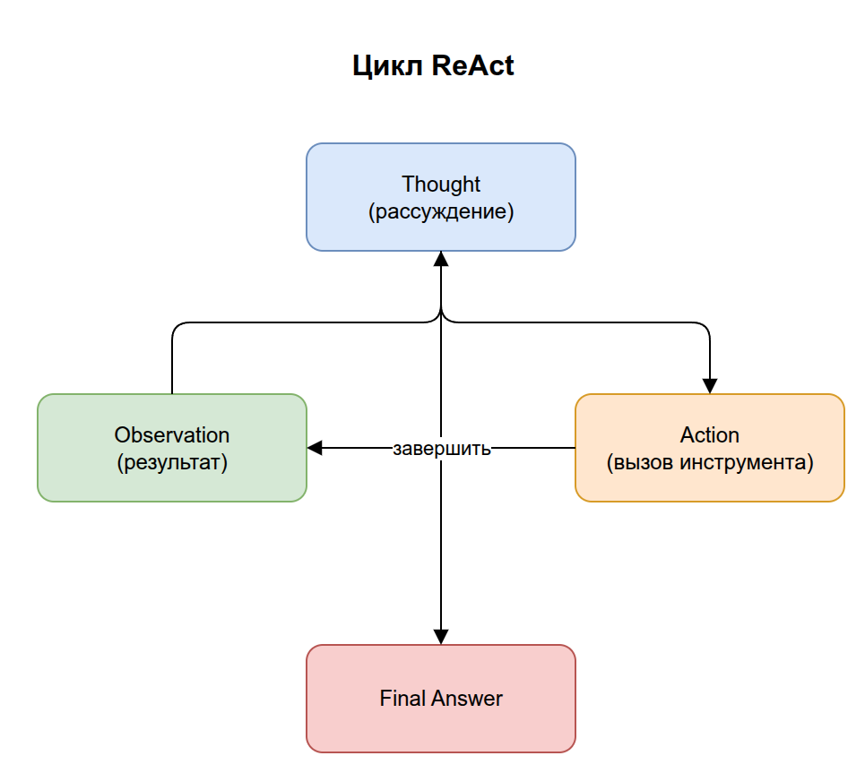
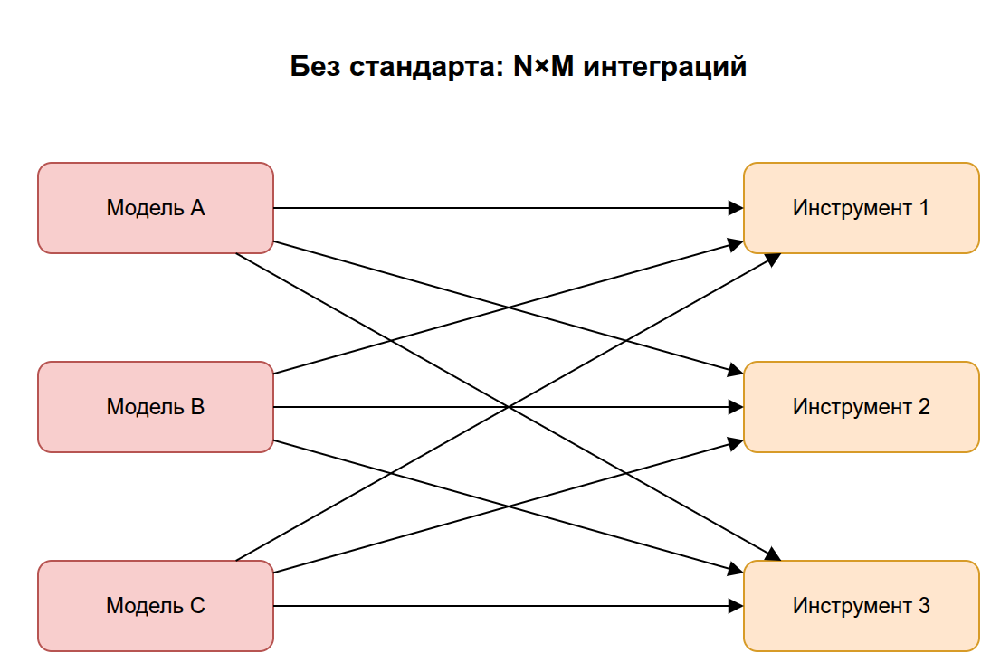
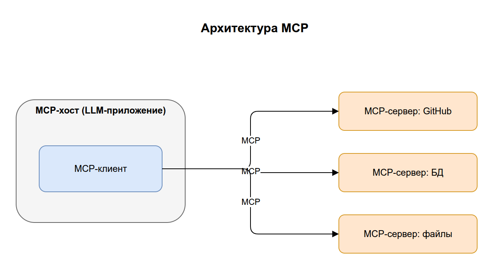
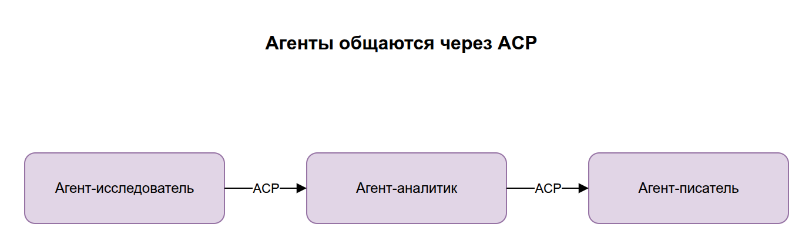
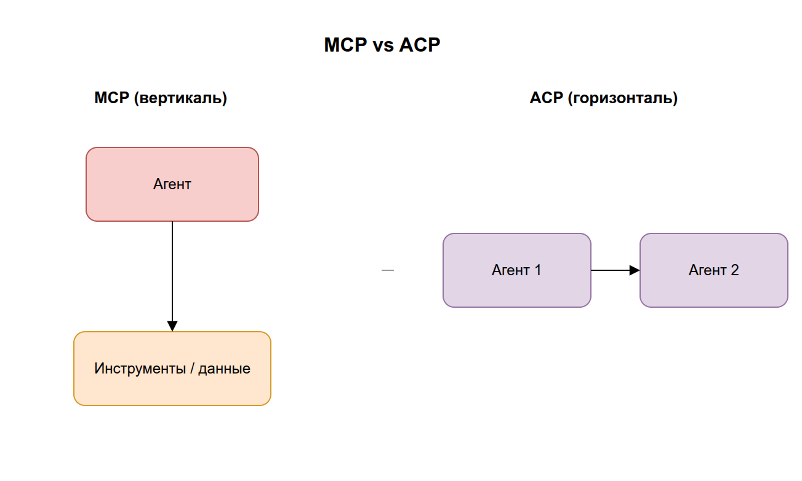
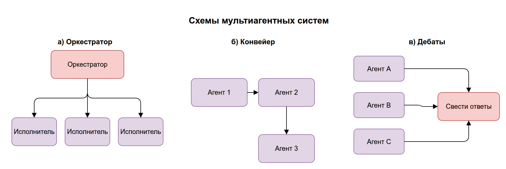

# 03. ИИ-агенты и протоколы (MCP, ACP)

В разделе 02 мы выяснили, что «голая» LLM умеет только генерировать текст и ничего не может сделать во внешнем мире. Этот раздел — про то, как превратить пассивный «генератор текста» в активного **агента**, который умеет пользоваться инструментами, и как агенты и инструменты общаются между собой через **MCP** и **ACP**.

## Содержание

1. [От LLM к агенту](#1-от-llm-к-агенту)
2. [Что такое инструмент (tool) и tool calling](#2-инструменты-и-tool-calling)
3. [Цикл работы агента (ReAct)](#3-цикл-работы-агента-react)
4. [MCP — протокол подключения инструментов](#4-mcp--протокол-подключения-инструментов)
5. [ACP — протокол общения между агентами](#5-acp--протокол-общения-между-агентами)
6. [MCP vs ACP: в чём разница](#6-mcp-vs-acp-в-чём-разница)
7. [Мультиагентные системы](#7-мультиагентные-системы)
8. [Ключевые термины раздела](#8-ключевые-термины-раздела)

---

## 1. От LLM к агенту

**ИИ-агент** — это система, в центре которой LLM, но которая дополнительно умеет:

- **рассуждать**, что нужно сделать для достижения цели;
- **выбирать и вызывать инструменты** (поиск, калькулятор, API, базы данных);
- **наблюдать результат** и решать, что делать дальше;
- **повторять** этот цикл, пока задача не решена.

Разница принципиальна:

| | Чистая LLM | Агент |
|---|---|---|
| Что умеет | Сгенерировать текст один раз | Планировать и действовать в цикле |
| Доступ к миру | Нет | Через инструменты (API, файлы, веб) |
| Пример | «Объясни, как узнать погоду» | Сам вызовет погодный API и вернёт реальную температуру |

> Аналогия: LLM — это очень эрудированный человек, запертый в комнате без окон, телефона и интернета. Агент — тот же человек, которому дали телефон, поисковик и доступ к базам. Теперь он может не только рассуждать, но и проверять и действовать.

> **Примеры LLM (сами модели):** GPT-4o (OpenAI), Claude (Anthropic), Gemini (Google), DeepSeek-V3 / R1, Llama (Meta), Qwen, Mistral. Это «мозги» — их обучают и затем встраивают в приложения.
>
> **Примеры ИИ-агентов (приложения на базе моделей):** ChatGPT и DeepSeek (чат-приложения с памятью, веб-поиском и вызовом инструментов), Perplexity (поисковый агент), кодинг-агенты — Claude Code, Cursor, GitHub Copilot в режиме агента.
>
> Частая путаница: **ChatGPT — это не «LLM», а приложение** поверх модели GPT. Сама модель только генерирует текст; память, поиск и вызов инструментов добавляет приложение-агент вокруг неё.



> Исходник диаграммы: [`diagrams/03-llm-to-agent.drawio`](../diagrams/03-llm-to-agent.drawio)

---

## 2. Инструменты и tool calling

**Инструмент (tool)** — это любая функция, которую агент может вызвать: «найти в интернете», «прочитать файл», «отправить письмо», «выполнить SQL-запрос».

> **Примеры инструментов:** веб-поиск (Google/Tavily), калькулятор, чтение и запись файлов, запрос к базе данных (SQL), вызов внешнего API (погода, курсы валют), отправка письма, запуск кода.

**Tool calling (вызов инструментов, function calling)** — механизм, с помощью которого LLM просит выполнить инструмент. Важно понять: **LLM сама не выполняет код**. Она лишь генерирует структурированный запрос (обычно JSON) вида «хочу вызвать инструмент `get_weather` с аргументом `city="Москва"`». А выполняет этот вызов программа-обёртка вокруг модели (рантайм агента) и возвращает результат обратно в контекст.

**Рантайм агента (agent runtime)** — это программа, которая «крутит» агента: отправляет запросы в LLM, читает её ответы, реально вызывает запрошенные инструменты и кладёт их результаты обратно в контекст модели. LLM — это только «мозг», который думает и решает; рантайм — «тело и руки», которые выполняют действия и связывают модель с внешним миром (файлами, сетью, базами данных). Без рантайма запрос модели «хочу вызвать `get_weather`» остался бы просто текстом: некому его исполнить и вернуть результат. Именно рантайм повторяет цикл «думать → действовать → наблюдать», пока задача не будет решена.

```
1. Разработчик описывает инструменты модели:
   get_weather(city: str) -> "возвращает погоду в городе"

2. Пользователь: "Какая погода в Москве?"

3. LLM генерирует НЕ ответ, а запрос на вызов:
   { "tool": "get_weather", "args": { "city": "Москва" } }

4. Рантайм выполняет реальную функцию → "+5°C, облачно"

5. Результат возвращается в LLM, и она формулирует ответ:
   "Сейчас в Москве +5°C, облачно."
```



> Исходник диаграммы: [`diagrams/03-tool-calling.drawio`](../diagrams/03-tool-calling.drawio)

> Ключевой момент: модель *решает*, что и с какими аргументами вызвать, но *выполнение* всегда вне модели. Это граница безопасности — именно тут разработчик контролирует, что агенту вообще позволено делать.

---

## 3. Цикл работы агента (ReAct)

Самый распространённый паттерн работы агента — **ReAct** (Reasoning + Acting, «рассуждение + действие»). Агент крутится в цикле:

```
   ┌─────────────────────────────────────────┐
   │                                          │
   ▼                                          │
[ Thought ]  — модель рассуждает: что делать? │
   │                                          │
   ▼                                          │
[ Action ]   — выбирает инструмент и аргументы│
   │                                          │
   ▼                                          │
[ Observation ] — получает результат вызова ──┘
   │
   ▼ (когда цели достигнуты)
[ Final Answer ] — формулирует ответ пользователю
```

Пример рассуждения агента «Сколько лет разнице между основанием Москвы и Санкт-Петербурга?»:

1. *Thought:* нужно узнать год основания Москвы → *Action:* поиск → *Observation:* 1147.
2. *Thought:* нужен год основания СПб → *Action:* поиск → *Observation:* 1703.
3. *Thought:* теперь вычту → *Action:* калькулятор(1703-1147) → *Observation:* 556.
4. *Final Answer:* «Разница составляет 556 лет».



> Исходник диаграммы: [`diagrams/03-react-loop.drawio`](../diagrams/03-react-loop.drawio)

> На практике: именно этот цикл реализуют фреймворки вроде **LangGraph** (раздел 05). Они управляют тем, как агент переходит между «думать», «действовать» и «отвечать».

---

## 4. MCP — протокол подключения инструментов

**MCP (Model Context Protocol)** — открытый стандарт (от Anthropic), который описывает **единый способ** подключать внешние инструменты, данные и сервисы к приложению с LLM (хосту/агенту). Это решает проблему «зоопарка интеграций».

Важно: по протоколу MCP общается **не сама LLM**, а рантайм агента (точнее, MCP-клиент внутри него). LLM лишь решает, *какой* инструмент вызвать, и формулирует запрос текстом; фактическое соединение с MCP-сервером и вызов держит хост. Название содержит «Model», но подключение идёт к **окружению модели**, а не к её весам.

### Какую проблему решает

Без стандарта каждый инструмент подключается к каждому приложению по-своему: для 5 приложений и 10 инструментов нужно 50 разных интеграций. MCP вводит общий «разъём» — как USB: один стандартный порт, к которому подходит любое совместимое устройство.



> Исходник диаграммы: [`diagrams/03-mcp-problem.drawio`](../diagrams/03-mcp-problem.drawio)

### Архитектура MCP

- **MCP-хост** — приложение с LLM (например, IDE или чат-клиент).
- **MCP-клиент** — компонент внутри хоста, который говорит по протоколу.
- **MCP-сервер** — отдельная программа, которая предоставляет инструменты/данные (например, «сервер для работы с GitHub», «сервер для файловой системы»).

> **Примеры MCP-хостов:** Claude Desktop, Cursor, VS Code (с поддержкой MCP).
> **Примеры MCP-серверов:** GitHub, файловая система, PostgreSQL, Slack, Google Drive, веб-поиск (Brave/Tavily).

Один хост может подключать много MCP-серверов одновременно. Каждый сервер объявляет, какие у него есть **tools** (действия), **resources** (данные для чтения) и **prompts** (шаблоны).



> Исходник диаграммы: [`diagrams/03-mcp-architecture.drawio`](../diagrams/03-mcp-architecture.drawio)

> На практике: «подключить MCP-сервер» означает дать вашему AI-ассистенту новый набор способностей — например, читать вашу Jira, ходить в базу данных или искать в Google. Вы не переписываете модель — вы просто подключаете очередной «разъём».

---

## 5. ACP — протокол общения между агентами

**ACP (Agent Communication Protocol)** — стандарт, описывающий, **как агенты общаются друг с другом**: передают задачи, обмениваются результатами, координируют совместную работу.

Если MCP отвечает на вопрос «как агенту дотянуться до инструмента/данных», то ACP отвечает на вопрос «как агенту делегировать работу другому агенту и понять его ответ».

### Зачем агентам общаться

Сложную задачу часто выгоднее разбить между **специализированными агентами**:
- агент-исследователь ищет информацию;
- агент-аналитик её обрабатывает;
- агент-писатель оформляет отчёт.

Чтобы они работали вместе, нужен общий «язык» — формат сообщений, способ передать задачу и получить результат, отследить статус. Это и есть ACP.



> Исходник диаграммы: [`diagrams/03-acp-overview.drawio`](../diagrams/03-acp-overview.drawio)

> Замечание: вокруг межагентного взаимодействия сейчас несколько конкурирующих инициатив (ACP, A2A и др.) — единого победителя пока нет, область быстро развивается. Главное — усвоить идею: это стандартизированный «протокол переговоров» между агентами.

---

## 6. MCP vs ACP: в чём разница

Это самая частая путаница, поэтому вынесем явно.

| | **MCP** | **ACP** |
|---|---|---|
| Соединяет | LLM/агента ↔ **инструменты и данные** | агента ↔ **другого агента** |
| Вопрос, на который отвечает | «Как дать модели руки?» | «Как агентам договориться между собой?» |
| Аналогия | USB-порт для подключения устройств | Общий рабочий язык в команде |
| Пример | Агент читает вашу базу данных | Агент-менеджер раздаёт подзадачи агентам-исполнителям |



> Исходник диаграммы: [`diagrams/03-mcp-vs-acp.drawio`](../diagrams/03-mcp-vs-acp.drawio)

> Запомнить просто: **MCP — вертикаль** (агент тянется вниз к инструментам), **ACP — горизонталь** (агент общается вбок с равными себе агентами).

---

## 7. Мультиагентные системы

**Мультиагентная система** — это несколько агентов, совместно решающих задачу. Типичные схемы:

- **Оркестратор + исполнители (orchestrator-workers).** Главный агент разбивает задачу и раздаёт подзадачи специализированным агентам, затем собирает результаты.
- **Конвейер (pipeline).** Агенты выстроены в цепочку: выход одного — вход следующего.
- **Дебаты / голосование.** Несколько агентов решают одну задачу независимо, затем сверяют ответы для повышения надёжности.



> Исходник диаграммы: [`diagrams/03-multiagent-patterns.drawio`](../diagrams/03-multiagent-patterns.drawio)

Здесь сходятся все нити раздела: каждый агент — это LLM (раздел 02) с инструментами через **MCP**, а между собой агенты координируются через **ACP**. Оркестрацию таких систем удобно описывать графом — этим занимается **LangGraph** (раздел 05).

---

## 8. Ключевые термины раздела

| Термин | Короткое определение | Примеры |
|--------|----------------------|---------|
| **LLM** | Модель, генерирующая текст («мозг») | GPT-4o, Claude, Gemini, DeepSeek, Llama |
| **ИИ-агент** | Система на базе LLM, которая планирует и действует в цикле через инструменты | ChatGPT, Perplexity, Claude Code, Cursor |
| **Инструмент (tool)** | Функция, которую агент может вызвать (поиск, API, файлы и т.д.) | Веб-поиск, SQL-запрос, чтение файла, погодный API |
| **Tool calling** | Механизм, которым LLM запрашивает вызов инструмента (выполняет рантайм, не модель) | `{ "tool": "get_weather", "args": {...} }` |
| **Рантайм агента** | Программа, которая крутит цикл агента: вызывает LLM, исполняет инструменты, возвращает результаты в контекст | LangGraph, рантайм Claude Code / Cursor |
| **ReAct** | Паттерн «рассуждение → действие → наблюдение» в цикле | Думать → вызвать поиск → прочитать → ответить |
| **MCP** | Стандарт подключения инструментов и данных к приложению с LLM («USB для AI») | Подключить GitHub-сервер к Cursor |
| **MCP-сервер** | Программа, предоставляющая инструменты/данные по протоколу MCP | GitHub, файловая система, PostgreSQL, Slack |
| **ACP** | Стандарт общения между агентами | Оркестратор передаёт задачу агенту-исполнителю |
| **Мультиагентная система** | Несколько агентов, совместно решающих задачу | Агент-планировщик + агент-кодер + агент-тестер |
| **Оркестратор** | Главный агент, раздающий подзадачи исполнителям | Ведущий агент координирует подагентов |

---

## 9. Опросник для самопроверки

Отвечайте своими словами, не подсматривая. Ссылки — куда вернуться при затруднении.

### Уровень 1. Понимание определений

1. Чем агент отличается от «чистой» LLM (что он умеет дополнительно)? → [§1](#1-от-llm-к-агенту)
2. Что такое инструмент (tool)? Приведите 2–3 примера. → [§2](#2-инструменты-и-tool-calling)
3. Что означают буквы в названии паттерна ReAct? → [§3](#3-цикл-работы-агента-react)
4. Что соединяет MCP, а что — ACP (одной фразой каждый)? → [§6](#6-mcp-vs-acp-в-чём-разница)
5. Что такое мультиагентная система? → [§7](#7-мультиагентные-системы)

### Уровень 2. Связи между понятиями

6. При tool calling — кто реально выполняет код инструмента: сама LLM или что-то ещё? Почему это важно для безопасности? → [§2](#2-инструменты-и-tool-calling)
7. Опишите цикл ReAct (Thought → Action → Observation). Когда он завершается? → [§3](#3-цикл-работы-агента-react)
8. Какую проблему решает MCP? Почему аналогия с USB уместна? → [§4](#4-mcp--протокол-подключения-инструментов)
9. Назовите три части архитектуры MCP (хост, клиент, сервер) и роль каждой. → [§4](#архитектура-mcp)
10. Чем «вертикаль» (MCP) отличается от «горизонтали» (ACP)? → [§6](#6-mcp-vs-acp-в-чём-разница)

### Уровень 3. Применение

11. Вы хотите, чтобы ассистент мог читать вашу Jira и базу данных. Что вы подключаете — MCP-серверы или ACP? → [§4](#4-mcp--протокол-подключения-инструментов)
12. Задачу решают агент-исследователь, агент-аналитик и агент-писатель, передавая результаты друг другу. Какой протокол описывает их общение и какая это схема мультиагентной системы? → [§5](#5-acp--протокол-общения-между-агентами), [§7](#7-мультиагентные-системы)
13. Агенту нужно посчитать разницу дат, но он выдумывает год основания города. Какого шага ReAct-цикла и какого инструмента ему не хватает? → [§3](#3-цикл-работы-агента-react)
14. Почему именно граф (а не линейная цепочка) удобен для реализации агента? (свяжите с разделом 05) → [§3](#3-цикл-работы-агента-react)

### Как оценить результат

- **12–14 уверенных ответов** → отлично, переходите к разделу 04.
- **7–11** → повторите §2 (tool calling), §3 (ReAct) и §6 (MCP vs ACP) — это самые путаемые места.
- **Меньше 7** → перечитайте раздел; обратите особое внимание на разницу MCP/ACP (§6) — её спрашивают чаще всего.

> Что «подтянуть» по темам: 1, 6 → суть агента и tool calling; 3, 7, 13 → цикл ReAct; 4, 8–9, 11 → MCP; 5, 10, 12 → ACP и мультиагенты; 14 → мостик к LangGraph (раздел 05).

---

**Назад:** [← 02. LLM](../02-llm/README.md) &nbsp;|&nbsp; **Дальше:** [04. RAG →](../04-rag/README.md)

Мы дали агенту инструменты для действий. Осталось решить вторую проблему LLM из раздела 02 — доступ к свежим и приватным знаниям. Этим занимается RAG.
