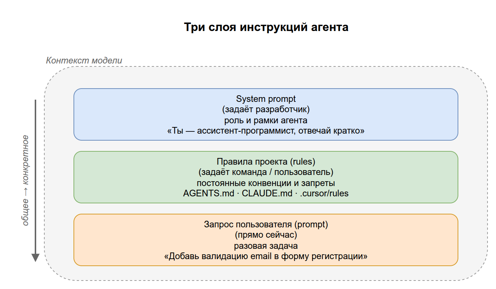
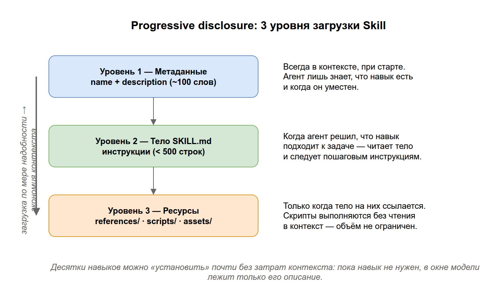

# 03. ИИ-агенты и протоколы (MCP, ACP)

В разделе 02 мы выяснили, что «голая» LLM умеет только генерировать текст и ничего не может сделать во внешнем мире. Этот раздел — про то, как превратить пассивный «генератор текста» в активного **агента**, который умеет пользоваться инструментами, и как агенты и инструменты общаются между собой через **MCP** и **ACP**.

## Содержание

1. [От LLM к агенту](#1-от-llm-к-агенту)
2. [Что такое инструмент (tool) и tool calling](#2-инструменты-и-tool-calling)
3. [Цикл работы агента (ReAct)](#3-цикл-работы-агента-react)
4. [Чем управляется поведение агента: инструкции и правила (rules)](#4-чем-управляется-поведение-агента-инструкции-и-правила-rules)
5. [Skills — переиспользуемые наборы навыков](#5-skills--переиспользуемые-наборы-навыков)
6. [MCP — протокол подключения инструментов](#6-mcp--протокол-подключения-инструментов)
7. [ACP — протокол общения между агентами](#7-acp--протокол-общения-между-агентами)
8. [MCP vs ACP: в чём разница](#8-mcp-vs-acp-в-чём-разница)
9. [Мультиагентные системы](#9-мультиагентные-системы)
10. [Ключевые термины раздела](#10-ключевые-термины-раздела)

---

## 1. От LLM к агенту

**ИИ-агент** — это система, в центре которой LLM, но которая дополнительно умеет:

- **рассуждать**, что нужно сделать для достижения цели;
- **выбирать и вызывать инструменты** (поиск, калькулятор, API, базы данных);
- **наблюдать результат** и решать, что делать дальше;
- **повторять** этот цикл, пока задача не решена.

Разница принципиальна:

| | Чистая LLM | Агент |
|---|---|---|
| Что умеет | Сгенерировать текст один раз | Планировать и действовать в цикле |
| Доступ к миру | Нет | Через инструменты (API, файлы, веб) |
| Пример | «Объясни, как узнать погоду» | Сам вызовет погодный API и вернёт реальную температуру |

> Аналогия: LLM — это очень эрудированный человек, запертый в комнате без окон, телефона и интернета. Агент — тот же человек, которому дали телефон, поисковик и доступ к базам. Теперь он может не только рассуждать, но и проверять и действовать.

> **Примеры LLM (сами модели):** GPT-4o (OpenAI), Claude (Anthropic), Gemini (Google), DeepSeek-V3 / R1, Llama (Meta), Qwen, Mistral. Это «мозги» — их обучают и затем встраивают в приложения.
>
> **Примеры ИИ-агентов (приложения на базе моделей):** ChatGPT и DeepSeek (чат-приложения с памятью, веб-поиском и вызовом инструментов), Perplexity (поисковый агент), кодинг-агенты — Claude Code, Cursor, GitHub Copilot в режиме агента.
>
> Частая путаница: **ChatGPT — это не «LLM», а приложение** поверх модели GPT. Сама модель только генерирует текст; память, поиск и вызов инструментов добавляет приложение-агент вокруг неё.


> Исходник диаграммы: [`diagrams/03-llm-to-agent.drawio`](../diagrams/03-llm-to-agent.drawio)

---

## 2. Инструменты и tool calling

**Инструмент (tool)** — это любая функция, которую агент может вызвать: «найти в интернете», «прочитать файл», «отправить письмо», «выполнить SQL-запрос».

> **Примеры инструментов:** веб-поиск (Google/Tavily), калькулятор, чтение и запись файлов, запрос к базе данных (SQL), вызов внешнего API (погода, курсы валют), отправка письма, запуск кода.

**Tool calling (вызов инструментов, function calling)** — механизм, с помощью которого LLM просит выполнить инструмент. Важно понять: **LLM сама не выполняет код**. Она лишь генерирует структурированный запрос (обычно JSON) вида «хочу вызвать инструмент `get_weather` с аргументом `city="Москва"`». А выполняет этот вызов программа-обёртка вокруг модели (рантайм агента) и возвращает результат обратно в контекст.

**Рантайм агента (agent runtime)** — это программа, которая «крутит» агента: отправляет запросы в LLM, читает её ответы, реально вызывает запрошенные инструменты и кладёт их результаты обратно в контекст модели. LLM — это только «мозг», который думает и решает; рантайм — «тело и руки», которые выполняют действия и связывают модель с внешним миром (файлами, сетью, базами данных). Без рантайма запрос модели «хочу вызвать `get_weather`» остался бы просто текстом: некому его исполнить и вернуть результат. Именно рантайм повторяет цикл «думать → действовать → наблюдать», пока задача не будет решена.

```
1. Разработчик описывает инструменты модели:
   get_weather(city: str) -> "возвращает погоду в городе"

2. Пользователь: "Какая погода в Москве?"

3. LLM генерирует НЕ ответ, а запрос на вызов:
   { "tool": "get_weather", "args": { "city": "Москва" } }

4. Рантайм выполняет реальную функцию → "+5°C, облачно"

5. Результат возвращается в LLM, и она формулирует ответ:
   "Сейчас в Москве +5°C, облачно."
```

Граница «модель решает / рантайм выполняет» в коде выглядит так:

```python
from typing import Callable


def get_weather(city: str) -> str:
    return f"+5°C, облачно в городе {city}"


tools: dict[str, Callable] = {"get_weather": get_weather}

call: dict = {"tool": "get_weather", "args": {"city": "Москва"}}  # сгенерила LLM
result: str = tools[call["tool"]](**call["args"])                 # выполнил рантайм
```


> Исходник диаграммы: [`diagrams/03-tool-calling.drawio`](../diagrams/03-tool-calling.drawio)

> Ключевой момент: модель *решает*, что и с какими аргументами вызвать, но *выполнение* всегда вне модели. Это граница безопасности — именно тут разработчик контролирует, что агенту вообще позволено делать.

---

## 3. Цикл работы агента (ReAct)

Самый распространённый паттерн работы агента — **ReAct** (Reasoning + Acting, «рассуждение + действие»). Агент крутится в цикле:

```
   ┌─────────────────────────────────────────┐
   │                                          │
   ▼                                          │
[ Thought ]  — модель рассуждает: что делать? │
   │                                          │
   ▼                                          │
[ Action ]   — выбирает инструмент и аргументы│
   │                                          │
   ▼                                          │
[ Observation ] — получает результат вызова ──┘
   │
   ▼ (когда цели достигнуты)
[ Final Answer ] — формулирует ответ пользователю
```

Пример рассуждения агента «Сколько лет разнице между основанием Москвы и Санкт-Петербурга?»:

1. *Thought:* нужно узнать год основания Москвы → *Action:* поиск → *Observation:* 1147.
2. *Thought:* нужен год основания СПб → *Action:* поиск → *Observation:* 1703.
3. *Thought:* теперь вычту → *Action:* калькулятор(1703-1147) → *Observation:* 556.
4. *Final Answer:* «Разница составляет 556 лет».

```python
# Иллюстративный скелет ReAct-цикла (его крутит рантайм агента)
context: str = question
while not done:
    thought: str = llm(context)        # Thought: что делать дальше?
    action: dict = choose_tool(thought)  # Action: выбрать инструмент + аргументы
    observation: str = run(action)     # Observation: результат вызова
    context += observation             # дописали в контекст и повторяем
```


> Исходник диаграммы: [`diagrams/03-react-loop.drawio`](../diagrams/03-react-loop.drawio)

> На практике: именно этот цикл реализуют фреймворки вроде **LangGraph** (раздел 05). Они управляют тем, как агент переходит между «думать», «действовать» и «отвечать».

---

## 4. Чем управляется поведение агента: инструкции и правила (rules)

Цикл ReAct объясняет, *как* агент думает и действует. Но что задаёт, *как именно* он должен себя вести — каким тоном отвечать, какие шаги соблюдать, чего никогда не делать? Это слой **инструкций**. Он подмешивается в контекст модели ещё до того, как агент начнёт работать, и поэтому влияет на каждый его шаг.

Удобно различать три слоя инструкций — от самого общего к самому конкретному:

| Слой | Кто задаёт | Что описывает | Пример |
|---|---|---|---|
| **System prompt** | разработчик приложения | базовую роль и рамки агента | «Ты — ассистент-программист. Объясняй кратко, не выдумывай API» |
| **Правила (rules)** | команда / пользователь проекта | постоянные конвенции и запреты для конкретного проекта | «В этом репозитории используем только TypeScript и отступ в 2 пробела» |
| **Запрос (prompt)** | пользователь прямо сейчас | разовую задачу | «Добавь валидацию email в форму регистрации» |

> System prompt мы уже коротко упоминали в разделе 02 (§8) как часть промпта. Здесь важно увидеть его роль в агенте: это не разовое указание, а **постоянная рамка**, которая действует на протяжении всего цикла ReAct.

### Что такое правила (rules)

**Правила (rules)** — это постоянные инструкции уровня проекта, которые автоматически подмешиваются в контекст агента, чтобы не повторять их в каждом запросе. В реальных инструментах они живут в специальных файлах рядом с кодом: `AGENTS.md`, `CLAUDE.md`, `.cursor/rules` и т.п. Агент читает их при старте и следует им, пока работает в этом проекте.

Правила обычно описывают:
- **конвенции** — стиль кода, структуру проекта, формат коммитов;
- **запреты** — «не трогай папку `legacy/`», «не пиши секреты в логи»;
- **контекст** — какие команды запускать для сборки и тестов, где лежит документация.

> Аналогия: system prompt — это **должностная инструкция** сотрудника («ты бариста, будь вежлив»). Правила проекта — **внутренний регламент конкретного кафе** («у нас молоко наливают до логотипа, кассу закрываем в 22:00»). Запрос пользователя — **заказ клиента** прямо сейчас («капучино на овсяном»). Все три слоя действуют одновременно.

> На практике: чем точнее правила, тем меньше агент «фантазирует» и тем реже приходится поправлять его вручную. Хорошие правила — это вынесенные «за скобки» договорённости команды, которые иначе пришлось бы диктовать в каждом сообщении.

### Правила, память и контекст — не путать

- **Правила** — заданы заранее и не меняются по ходу работы (вы их пишете сами).
- **Память** — то, что агент сам накапливает между сессиями (факты о вас, прошлые решения).
- **Контекст** — всё, что попало в окно модели прямо сейчас (раздел 02, §6): и правила, и память, и текущий запрос, и результаты вызовов инструментов.

То есть правила и память — это *источники*, которые наполняют *контекст*. Сам контекст ограничен по размеру, поэтому правила стараются держать короткими и по делу.



> Исходник диаграммы: [`diagrams/03-instruction-layers.drawio`](../diagrams/03-instruction-layers.drawio)

---

## 5. Skills — переиспользуемые наборы навыков

Инструменты (§2) дают агенту *действия*, правила (§4) задают *рамки поведения*. Но есть третья потребность: дать агенту **готовую процедуру** — пошаговое знание о том, как решать определённый класс задач («как заполнять PDF-формы», «как оформлять диаграммы по нашему гайдстайлу»). Для этого служат **Skills (навыки)**.

**Skill (навык)** — это папка с файлом `SKILL.md`, в котором описано, *что* агент умеет и *когда* это применять, плюс опционально приложенные ресурсы: справочные документы, скрипты, шаблоны. Стандарт Agent Skills предложен Anthropic.

```
skill-name/
├── SKILL.md          ← обязательный: метаданные + инструкции
└── (необязательно)
    ├── scripts/      — готовый код для рутинных операций
    ├── references/   — справочные документы, читаются по мере надобности
    └── assets/       — шаблоны, иконки, шрифты для вставки в результат
```

Сам `SKILL.md` состоит из двух частей: **YAML-заголовка** (`name` и `description`) и тела с инструкциями в Markdown.

```markdown
---
name: pdf-forms
description: Заполнение и извлечение данных из PDF-форм. Использовать, когда
  пользователь просит заполнить, прочитать или сгенерировать PDF с полями.
---

# Работа с PDF-формами

## Инструкции
1. Определи поля формы скриптом `scripts/inspect.py`.
2. Сопоставь данные пользователя с полями.
3. ...

## Примеры
...
```

### Принцип progressive disclosure (постепенное раскрытие)

Главная идея Skills — **не грузить всё в контекст сразу**. Знание раскрывается в три уровня, по мере необходимости:

| Уровень | Что загружается | Когда | Зачем |
|---|---|---|---|
| 1. Метаданные | `name` + `description` (~100 слов) | всегда, при старте | агент лишь *знает, что навык существует* и когда он уместен |
| 2. Тело `SKILL.md` | полные инструкции (рекоменд. < 500 строк) | когда агент решил, что навык подходит к задаче | агент получает пошаговое руководство |
| 3. Ресурсы | файлы из `references/`, `scripts/`, `assets/` | только когда на них ссылается тело | детали подгружаются точечно, скрипты вообще выполняются без чтения в контекст |

> Аналогия: Skill — это **хорошо организованный справочник**. На обложке (уровень 1) — название и аннотация: по ней понятно, нужна ли вообще эта книга. Открыв её (уровень 2), читаешь основную главу. И только если глава ссылается на приложение (уровень 3), лезешь в конец за подробностями. Не нужно зубрить весь справочник, чтобы им пользоваться.

Благодаря такому подходу можно «установить» агенту десятки навыков почти без затрат контекста: пока навык не нужен, в окне модели лежит только его короткое описание.



> Исходник диаграммы: [`diagrams/03-skill-disclosure.drawio`](../diagrams/03-skill-disclosure.drawio)

### Skill, tool и MCP — в чём разница

Это легко перепутать, поэтому зафиксируем:

| | **Tool / MCP** | **Skill** |
|---|---|---|
| Что даёт | *действие* во внешнем мире (вызвать API, прочитать файл) | *знание/процедуру* — как делать класс задач |
| Природа | исполняемая функция | инструкции (+ опционально скрипты и ресурсы) |
| Как попадает к агенту | объявляется рантаймом / MCP-сервером | лежит папкой на диске, читается по мере надобности |
| Аналогия | «руки» агента | «методичка» в руках агента |

На практике они дополняют друг друга: навык может *в инструкциях* говорить агенту, какие инструменты вызвать и в каком порядке. Skill — это «как делать», tool/MCP — «чем делать».

---

## 6. MCP — протокол подключения инструментов

**MCP (Model Context Protocol)** — открытый стандарт (от Anthropic), который описывает **единый способ** подключать внешние инструменты, данные и сервисы к приложению с LLM (хосту/агенту). Это решает проблему «зоопарка интеграций».

Важно: по протоколу MCP общается **не сама LLM**, а рантайм агента (точнее, MCP-клиент внутри него). LLM лишь решает, *какой* инструмент вызвать, и формулирует запрос текстом; фактическое соединение с MCP-сервером и вызов держит хост. Название содержит «Model», но подключение идёт к **окружению модели**, а не к её весам.

### Какую проблему решает

Без стандарта каждый инструмент подключается к каждому приложению по-своему: для 5 приложений и 10 инструментов нужно 50 разных интеграций. MCP вводит общий «разъём» — как USB: один стандартный порт, к которому подходит любое совместимое устройство.


> Исходник диаграммы: [`diagrams/03-mcp-problem.drawio`](../diagrams/03-mcp-problem.drawio)

### Архитектура MCP

- **MCP-хост** — приложение с LLM (например, IDE или чат-клиент).
- **MCP-клиент** — компонент внутри хоста, который говорит по протоколу.
- **MCP-сервер** — отдельная программа, которая предоставляет инструменты/данные (например, «сервер для работы с GitHub», «сервер для файловой системы»).

> **Примеры MCP-хостов:** Claude Desktop, Cursor, VS Code (с поддержкой MCP).
> **Примеры MCP-серверов:** GitHub, файловая система, PostgreSQL, Slack, Google Drive, веб-поиск (Brave/Tavily).

Один хост может подключать много MCP-серверов одновременно. Каждый сервер объявляет, какие у него есть **tools** (действия), **resources** (данные для чтения) и **prompts** (шаблоны).


> Исходник диаграммы: [`diagrams/03-mcp-architecture.drawio`](../diagrams/03-mcp-architecture.drawio)

> На практике: «подключить MCP-сервер» означает дать вашему AI-ассистенту новый набор способностей — например, читать вашу Jira, ходить в базу данных или искать в Google. Вы не переписываете модель — вы просто подключаете очередной «разъём».

### Пример подключения MCP-сервера

На практике MCP-сервер подключают декларативно: не пишут код интеграции, а прописывают в конфигурационном файле хоста (например, `claude_desktop_config.json` у Claude Desktop или `.cursor/mcp.json` у Cursor), какую команду запустить и какие переменные окружения ей передать:

```json
{
  "mcpServers": {
    "filesystem": {
      "command": "npx",
      "args": ["-y", "@modelcontextprotocol/server-filesystem", "/Users/me/projects"]
    },
    "notion": {
      "command": "npx",
      "args": ["-y", "@notionhq/notion-mcp-server"],
      "env": {
        "NOTION_TOKEN": "secret_xxxxxxxxxxxx"
      }
    },
    "sentry": {
      "url": "https://mcp.sentry.dev/sse",
      "headers": {
        "Authorization": "Bearer sntryu_xxxxxxxxxxxx"
      }
    }
  }
}
```

Хост читает этот файл при старте и подключается к каждому серверу одним из двух способов:
- **локальный процесс** (`command`/`args`) — хост сам запускает программу и говорит с ней по MCP через stdin/stdout. `filesystem` — официальный референсный сервер из SDK `@modelcontextprotocol` (пакет от самой Anthropic), `notion` — сторонний сервер с тем же способом подключения, но с токеном через `env`;
- **удалённый сервер** (`url`) — хост просто открывает HTTP/SSE-соединение к уже запущенному где-то серверу, как в примере с `sentry`.

Ключ верхнего уровня (`filesystem`, `notion`, `sentry`) — произвольное имя сервера, под которым он появится у агента; `env`/`headers` — секреты (токены), которые сервер получает из окружения или заголовков запроса, а не хранит в коде.

### Пример подключения самописного MCP-сервера

Необязательно ставить готовый пакет — MCP-сервер может быть вашим собственным скриптом, который просто умеет разговаривать по протоколу MCP (например, написан на Python с пакетом `mcp`, либо на TypeScript с `@modelcontextprotocol/sdk`). Тогда в конфиге вместо публичного пакета указывается путь к вашему коду:

```json
{
  "mcpServers": {
    "my-internal-api": {
      "command": "python",
      "args": ["-m", "my_mcp_server"],
      "cwd": "/Users/me/projects/my-mcp-server",
      "env": {
        "INTERNAL_API_TOKEN": "xxxxxxxxxxxx"
      }
    }
  }
}
```

Разницы для хоста нет: он не знает и не спрашивает, кто написал сервер — публичная команда npx или ваш локальный скрипт. Единственное требование — процесс должен на старте поднять MCP-сервер (обычно через `stdio`-транспорт из SDK) и объявить свои `tools`/`resources`/`prompts` по протоколу. Это удобно, когда нужно дать агенту доступ к внутреннему API компании, к которому нет и не будет готового пакета.

---

## 7. ACP — протокол общения между агентами

**ACP (Agent Communication Protocol)** — стандарт, описывающий, **как агенты общаются друг с другом**: передают задачи, обмениваются результатами, координируют совместную работу.

Если MCP отвечает на вопрос «как агенту дотянуться до инструмента/данных», то ACP отвечает на вопрос «как агенту делегировать работу другому агенту и понять его ответ».

### Зачем агентам общаться

Сложную задачу часто выгоднее разбить между **специализированными агентами**:
- агент-исследователь ищет информацию;
- агент-аналитик её обрабатывает;
- агент-писатель оформляет отчёт.

Чтобы они работали вместе, нужен общий «язык» — формат сообщений, способ передать задачу и получить результат, отследить статус. Это и есть ACP.


> Исходник диаграммы: [`diagrams/03-acp-overview.drawio`](../diagrams/03-acp-overview.drawio)

> Замечание: вокруг межагентного взаимодействия сейчас несколько конкурирующих инициатив (ACP, A2A и др.) — единого победителя пока нет, область быстро развивается. Главное — усвоить идею: это стандартизированный «протокол переговоров» между агентами.

---

## 8. MCP vs ACP: в чём разница

Это самая частая путаница, поэтому вынесем явно.

| | **MCP** | **ACP** |
|---|---|---|
| Соединяет | LLM/агента ↔ **инструменты и данные** | агента ↔ **другого агента** |
| Вопрос, на который отвечает | «Как дать модели руки?» | «Как агентам договориться между собой?» |
| Аналогия | USB-порт для подключения устройств | Общий рабочий язык в команде |
| Пример | Агент читает вашу базу данных | Агент-менеджер раздаёт подзадачи агентам-исполнителям |


> Исходник диаграммы: [`diagrams/03-mcp-vs-acp.drawio`](../diagrams/03-mcp-vs-acp.drawio)

> Запомнить просто: **MCP — вертикаль** (агент тянется вниз к инструментам), **ACP — горизонталь** (агент общается вбок с равными себе агентами).

---

## 9. Мультиагентные системы

**Мультиагентная система** — это несколько агентов, совместно решающих задачу. Типичные схемы:

- **Оркестратор + исполнители (orchestrator-workers).** Главный агент разбивает задачу и раздаёт подзадачи специализированным агентам, затем собирает результаты.
- **Конвейер (pipeline).** Агенты выстроены в цепочку: выход одного — вход следующего.
- **Дебаты / голосование.** Несколько агентов решают одну задачу независимо, затем сверяют ответы для повышения надёжности.


> Исходник диаграммы: [`diagrams/03-multiagent-patterns.drawio`](../diagrams/03-multiagent-patterns.drawio)

Здесь сходятся все нити раздела: каждый агент — это LLM (раздел 02) с инструментами через **MCP**, а между собой агенты координируются через **ACP**. Оркестрацию таких систем удобно описывать графом — этим занимается **LangGraph** (раздел 05).

---

## 10. Ключевые термины раздела

| Термин | Короткое определение | Примеры |
|--------|----------------------|---------|
| **LLM** | Модель, генерирующая текст («мозг») | GPT-4o, Claude, Gemini, DeepSeek, Llama |
| **ИИ-агент** | Система на базе LLM, которая планирует и действует в цикле через инструменты | ChatGPT, Perplexity, Claude Code, Cursor |
| **Инструмент (tool)** | Функция, которую агент может вызвать (поиск, API, файлы и т.д.) | Веб-поиск, SQL-запрос, чтение файла, погодный API |
| **Tool calling** | Механизм, которым LLM запрашивает вызов инструмента (выполняет рантайм, не модель) | `{ "tool": "get_weather", "args": {...} }` |
| **Рантайм агента** | Программа, которая крутит цикл агента: вызывает LLM, исполняет инструменты, возвращает результаты в контекст | LangGraph, рантайм Claude Code / Cursor |
| **ReAct** | Паттерн «рассуждение → действие → наблюдение» в цикле | Думать → вызвать поиск → прочитать → ответить |
| **System prompt** | Постоянная инструкция, задающая роль и рамки агента | «Ты — ассистент-программист, отвечай кратко» |
| **Правила (rules)** | Постоянные конвенции/запреты уровня проекта, подмешиваемые в контекст | `AGENTS.md`, `CLAUDE.md`, `.cursor/rules` |
| **Skill (навык)** | Папка с `SKILL.md`: процедурное знание «как делать класс задач» + ресурсы | Навык заполнения PDF-форм, навык работы с draw.io |
| **Progressive disclosure** | Поэтапная загрузка навыка (метаданные → тело → ресурсы) ради экономии контекста | Сначала только `description`, тело — при срабатывании |
| **MCP** | Стандарт подключения инструментов и данных к приложению с LLM («USB для AI») | Подключить GitHub-сервер к Cursor |
| **MCP-сервер** | Программа, предоставляющая инструменты/данные по протоколу MCP | GitHub, файловая система, PostgreSQL, Slack |
| **ACP** | Стандарт общения между агентами | Оркестратор передаёт задачу агенту-исполнителю |
| **Мультиагентная система** | Несколько агентов, совместно решающих задачу | Агент-планировщик + агент-кодер + агент-тестер |
| **Оркестратор** | Главный агент, раздающий подзадачи исполнителям | Ведущий агент координирует подагентов |

---

## 11. Опросник для самопроверки

Отвечайте своими словами, не подсматривая. Ссылки — куда вернуться при затруднении.

### Уровень 1. Понимание определений

1. Чем агент отличается от «чистой» LLM (что он умеет дополнительно)? → [§1](#1-от-llm-к-агенту)
2. Что такое инструмент (tool)? Приведите 2–3 примера. → [§2](#2-инструменты-и-tool-calling)
3. Что означают буквы в названии паттерна ReAct? → [§3](#3-цикл-работы-агента-react)
4. Чем правила (rules) отличаются от разового запроса пользователя? → [§4](#4-чем-управляется-поведение-агента-инструкции-и-правила-rules)
5. Что такое Skill (навык) и из чего он состоит? → [§5](#5-skills--переиспользуемые-наборы-навыков)
6. Что соединяет MCP, а что — ACP (одной фразой каждый)? → [§8](#8-mcp-vs-acp-в-чём-разница)
7. Что такое мультиагентная система? → [§9](#9-мультиагентные-системы)

### Уровень 2. Связи между понятиями

8. При tool calling — кто реально выполняет код инструмента: сама LLM или что-то ещё? Почему это важно для безопасности? → [§2](#2-инструменты-и-tool-calling)
9. Опишите цикл ReAct (Thought → Action → Observation). Когда он завершается? → [§3](#3-цикл-работы-агента-react)
10. В чём разница между Skill и инструментом (tool)? → [§5](#5-skills--переиспользуемые-наборы-навыков)
11. Объясните принцип progressive disclosure: какие три уровня и зачем он нужен? → [§5](#принцип-progressive-disclosure-постепенное-раскрытие)
12. Какую проблему решает MCP? Почему аналогия с USB уместна? → [§6](#6-mcp--протокол-подключения-инструментов)
13. Назовите три части архитектуры MCP (хост, клиент, сервер) и роль каждой. → [§6](#архитектура-mcp)
14. Чем «вертикаль» (MCP) отличается от «горизонтали» (ACP)? → [§8](#8-mcp-vs-acp-в-чём-разница)

### Уровень 3. Применение

15. У команды есть договорённость «всегда писать тесты к новому коду». Куда её логичнее зашить, чтобы агент соблюдал её сам — в разовый запрос, в правила (rules) или в Skill? → [§4](#4-чем-управляется-поведение-агента-инструкции-и-правила-rules)
16. Вы часто просите агента оформлять отчёты по одному и тому же сложному шаблону с примерами и скриптом-генератором. Что здесь уместнее — правило или Skill? Почему? → [§5](#5-skills--переиспользуемые-наборы-навыков)
17. Вы хотите, чтобы ассистент мог читать вашу Jira и базу данных. Что вы подключаете — MCP-серверы или ACP? → [§6](#6-mcp--протокол-подключения-инструментов)
18. Задачу решают агент-исследователь, агент-аналитик и агент-писатель, передавая результаты друг другу. Какой протокол описывает их общение и какая это схема мультиагентной системы? → [§7](#7-acp--протокол-общения-между-агентами), [§9](#9-мультиагентные-системы)
19. Агенту нужно посчитать разницу дат, но он выдумывает год основания города. Какого шага ReAct-цикла и какого инструмента ему не хватает? → [§3](#3-цикл-работы-агента-react)
20. Почему именно граф (а не линейная цепочка) удобен для реализации агента? (свяжите с разделом 05) → [§3](#3-цикл-работы-агента-react)

### Как оценить результат

- **17–20 уверенных ответов** → отлично, переходите к разделу 04.
- **10–16** → повторите §2 (tool calling), §3 (ReAct), §5 (Skills) и §8 (MCP vs ACP) — это самые путаемые места.
- **Меньше 10** → перечитайте раздел; обратите особое внимание на разницу MCP/ACP (§8) и на тройку «правила / Skill / tool» (§4–§5) — их путают чаще всего.

> Что «подтянуть» по темам: 1, 8 → суть агента и tool calling; 3, 9, 19 → цикл ReAct; 4, 15 → инструкции и правила; 5, 10–11, 16 → Skills; 12, 13, 17 → MCP; 6, 14, 18 → ACP и мультиагенты; 20 → мостик к LangGraph (раздел 05).

---

**Назад:** [← 02. LLM](../02-llm/README.md) &nbsp;|&nbsp; **Дальше:** [04. RAG →](../04-rag/README.md)

Мы дали агенту инструменты для действий. Осталось решить вторую проблему LLM из раздела 02 — доступ к свежим и приватным знаниям. Этим занимается RAG.
