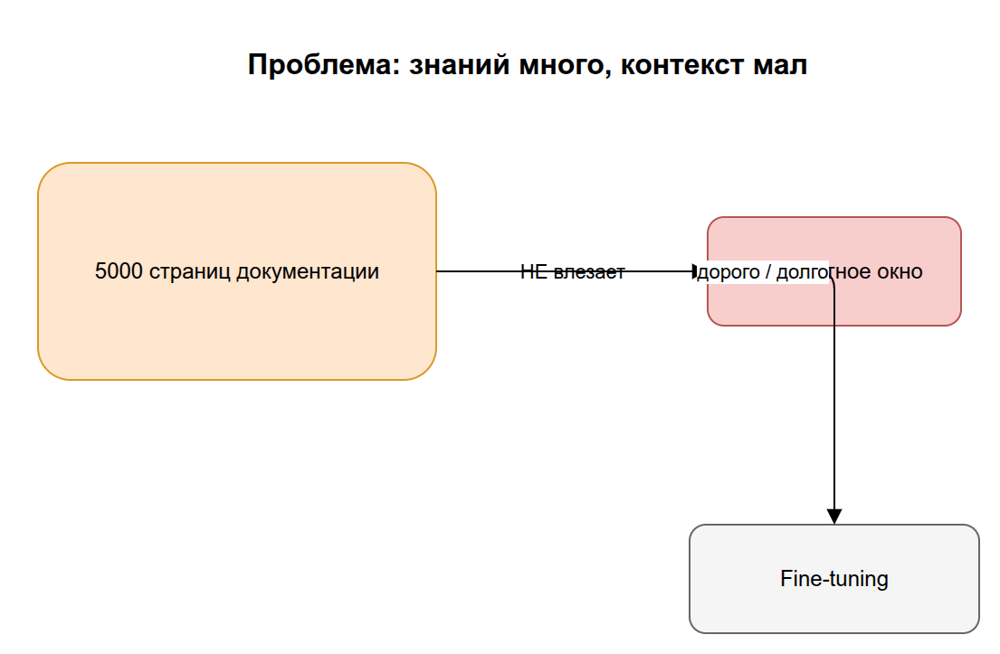
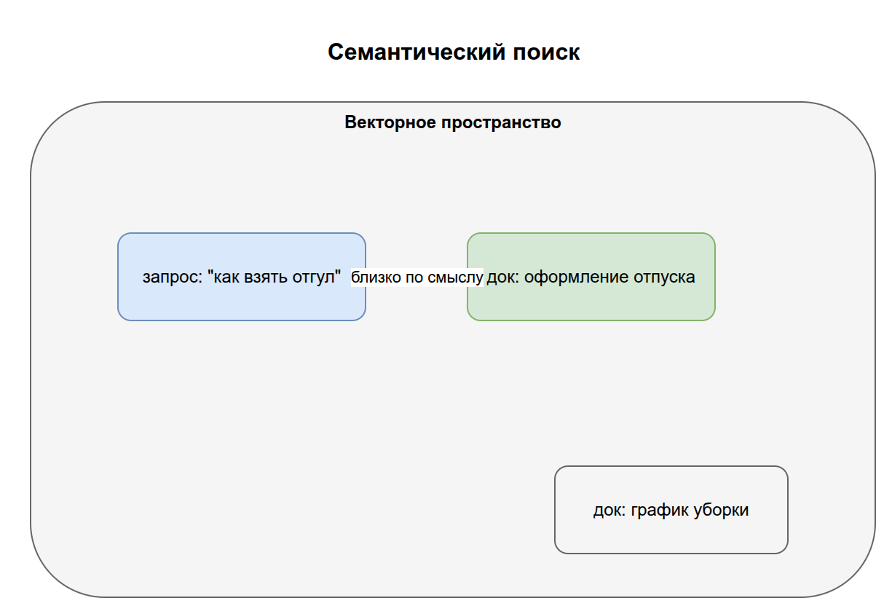
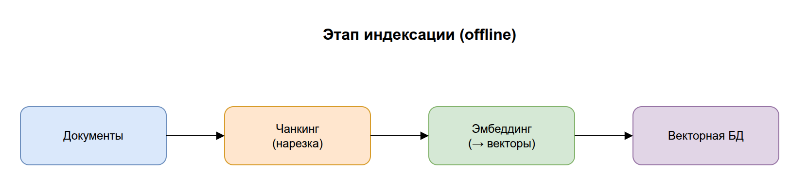
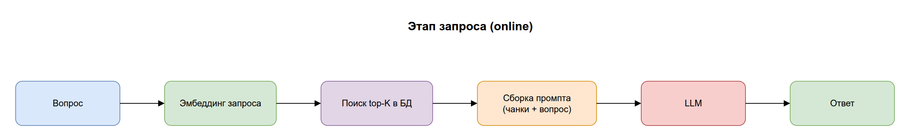
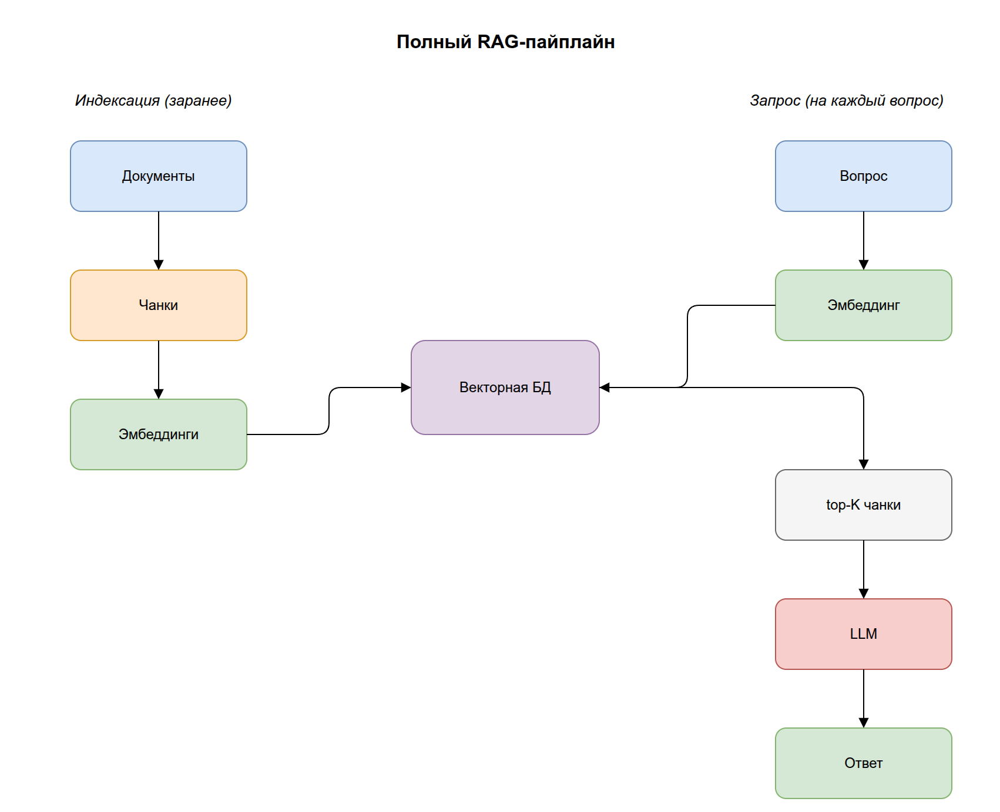
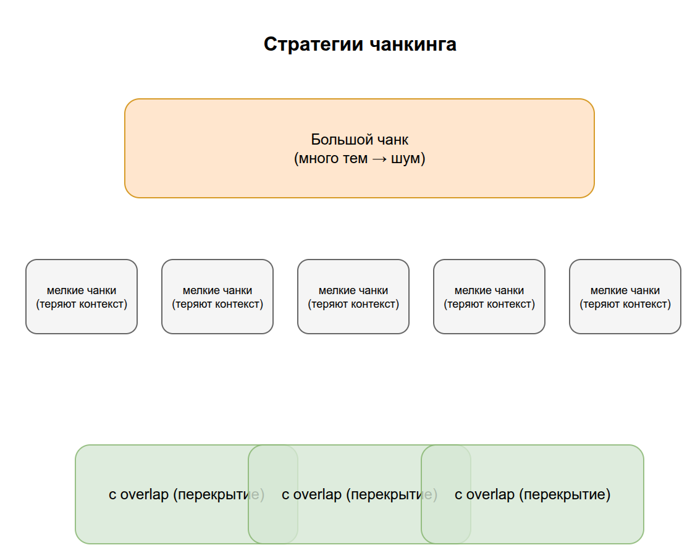
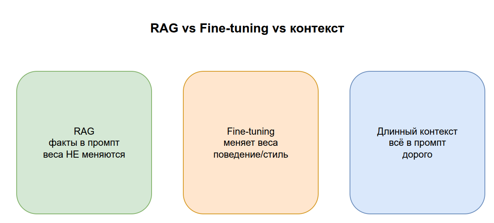
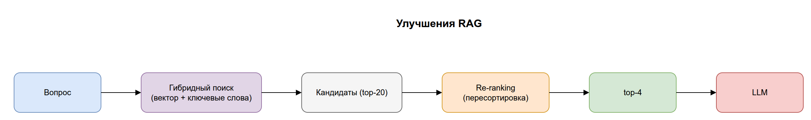

# 04. RAG — Retrieval-Augmented Generation

В разделе 02 мы перечислили ограничения LLM: знания заморожены, нет доступа к приватным данным, ограничен контекст. **RAG** — главный инструмент, который их обходит. Это, возможно, самая практически важная тема всей базы знаний: подавляющее большинство «корпоративных AI» построены именно на RAG.

Цель раздела: понять, что RAG — это всего лишь «найти нужные куски текста и подложить их в промпт перед ответом», и как именно работает каждый шаг.

## Содержание

1. [Какую проблему решает RAG](#1-какую-проблему-решает-rag)
2. [RAG в одном предложении](#2-rag-в-одном-предложении)
3. [Кирпичики RAG: embeddings и векторная БД](#3-кирпичики-rag-embeddings-и-векторная-бд)
4. [Этап индексации (offline)](#4-этап-индексации-offline)
5. [Этап запроса (online): RAG-пайплайн](#5-этап-запроса-online-rag-пайплайн)
6. [Полная картина RAG-пайплайна](#6-полная-картина-rag-пайплайна)
7. [Чанкинг: как резать документы](#7-чанкинг-как-резать-документы)
8. [RAG vs Fine-tuning vs длинный контекст](#8-rag-vs-fine-tuning-vs-длинный-контекст)
9. [Типичные проблемы и улучшения](#9-типичные-проблемы-и-улучшения)
10. [Ключевые термины раздела](#10-ключевые-термины-раздела)

---

## 1. Какую проблему решает RAG

Представьте: у вас есть 5000 страниц внутренней документации компании, и вы хотите, чтобы ассистент отвечал на вопросы по ней. Прямые пути не работают:

- **Дообучить модель (fine-tuning)** на этой документации — дорого, долго, и при каждом обновлении документа придётся переобучать.
- **Запихнуть все 5000 страниц в промпт** — не влезет в контекстное окно, а если и влезет, будет дорого и модель «утонет» в шуме.

RAG предлагает третий путь: **не пихать всё, а перед каждым вопросом находить только те 3–5 фрагментов, которые относятся к делу, и подкладывать их в промпт.**



> Исходник диаграммы: [`diagrams/04-rag-problem.drawio`](../diagrams/04-rag-problem.drawio)

---

## 2. RAG в одном предложении

**RAG (Retrieval-Augmented Generation) — это поиск релевантных фрагментов во внешней базе знаний и добавление их в промпт, чтобы LLM отвечала на основе фактов, а не только своей памяти.**

Расшифровка названия:
- **Retrieval (извлечение)** — найти нужные куски текста.
- **Augmented (дополненная)** — дополнить ими промпт.
- **Generation (генерация)** — модель генерирует ответ уже с этими кусками перед глазами.

> Аналогия: студент на экзамене «с открытой книгой». Вместо того чтобы вспоминать всё наизусть (и рисковать ошибиться), он быстро находит нужную страницу в учебнике и отвечает, опираясь на неё. RAG превращает LLM в такого студента.

Главные выгоды:
- ответы основаны на **ваших актуальных данных**;
- меньше галлюцинаций (модель опирается на текст, а не выдумывает);
- можно показать **источник** ответа;
- обновить знания = обновить базу, **без переобучения модели**.

---

## 3. Кирпичики RAG: embeddings и векторная БД

RAG стоит на двух понятиях. Первое — **embeddings** — мы уже ввели в [разделе 02](../02-llm/README.md#3-embeddings-текст-как-числа): это превращение текста в вектор чисел так, что близкий смысл → близкие векторы.

Второе — **векторная база данных (vector database)**. Это специальная БД, которая хранит векторы и умеет молниеносно отвечать на вопрос: «какие из миллиона векторов ближе всего к вот этому?». Именно так реализуется **поиск по смыслу (semantic search)**.

```
Обычная БД ищет:    WHERE text = 'отпуск'        (точное совпадение)
Векторная БД ищет:  ближайшие по смыслу векторы   (найдёт и "отпуск",
                                                    и "каникулы", и "отгул")
```

> Ключевое отличие от обычного поиска: запрос «как взять отгул» найдёт документ про «оформление отпуска», даже если слово «отгул» там не встречается ни разу — потому что их **векторы близки по смыслу**.

Популярные векторные БД: Pinecone, Weaviate, Qdrant, Chroma, pgvector (расширение для PostgreSQL).



> Исходник диаграммы: [`diagrams/04-vector-search.drawio`](../diagrams/04-vector-search.drawio)

---

## 4. Этап индексации (offline)

RAG состоит из **двух фаз**. Первая — индексация — делается заранее, один раз (и при каждом обновлении данных). Её задача — подготовить базу знаний к поиску.

Шаги индексации:

1. **Загрузка (load):** собрать исходные документы (PDF, веб-страницы, базы, Notion и т.д.).
2. **Чанкинг (chunking):** нарезать документы на небольшие фрагменты — **чанки** (например, по абзацу). Почему — см. [раздел 7](#7-чанкинг-как-резать-документы).
3. **Эмбеддинг (embed):** прогнать каждый чанк через модель эмбеддингов → получить вектор.
4. **Сохранение (store):** положить вектор + сам текст чанка в векторную БД.



> Исходник диаграммы: [`diagrams/04-indexing.drawio`](../diagrams/04-indexing.drawio)

```python
# Иллюстративный псевдокод этапа индексации
for document in documents:
    chunks = split_into_chunks(document)        # 2. чанкинг
    for chunk in chunks:
        vector = embedding_model.embed(chunk)   # 3. эмбеддинг
        vector_db.add(vector=vector, text=chunk)  # 4. сохранение
```

> Этот этап называют offline, потому что он не зависит от запросов пользователя и делается «в фоне». Пользователь его не видит.

---

## 5. Этап запроса (online): RAG-пайплайн

Вторая фаза происходит **в момент каждого вопроса пользователя**. Это и есть **RAG-пайплайн** в узком смысле:

1. **Эмбеддинг запроса:** превращаем вопрос пользователя в вектор той же моделью эмбеддингов.
2. **Поиск (retrieval):** просим векторную БД найти top-K ближайших чанков (например, 4 самых релевантных).
3. **Сборка промпта (augmentation):** вставляем найденные чанки в шаблон промпта вместе с вопросом.
4. **Генерация (generation):** отдаём собранный промпт LLM, она формулирует ответ на основе предоставленных фрагментов.

```python
# Иллюстративный псевдокод этапа запроса
def answer(question):
    q_vector = embedding_model.embed(question)         # 1
    chunks = vector_db.search(q_vector, top_k=4)       # 2. retrieval

    prompt = f"""Ответь на вопрос, используя ТОЛЬКО контекст ниже.
    Если ответа нет в контексте — так и скажи.

    Контекст:
    {format(chunks)}

    Вопрос: {question}"""                              # 3. augmentation

    return llm.generate(prompt)                        # 4. generation
```

> Инструкция «используй только контекст» — не формальность. Она резко снижает галлюцинации, заставляя модель опираться на поданные факты, а не на смутную память.



> Исходник диаграммы: [`diagrams/04-query-pipeline.drawio`](../diagrams/04-query-pipeline.drawio)

---

## 6. Полная картина RAG-пайплайна

Обе фазы вместе. Левая часть (индексация) выполняется заранее, правая (запрос) — на каждый вопрос. Связующее звено — векторная БД.



> Исходник диаграммы: [`diagrams/04-rag-full.drawio`](../diagrams/04-rag-full.drawio)

> На практике: «построить RAG» = выбрать загрузчики данных, стратегию чанкинга, модель эмбеддингов, векторную БД и шаблон промпта. Фреймворки **LangChain** и **LlamaIndex** (раздел 05) дают готовые кирпичики для каждого из этих шагов.

---

## 7. Чанкинг: как резать документы

**Чанк (chunk)** — фрагмент документа, который индексируется и ищется как единое целое. Размер чанка — один из самых влияющих на качество параметров.

- **Слишком крупные чанки:** в один фрагмент попадает много разных тем → поиск менее точный, в промпт идёт лишний «шум».
- **Слишком мелкие чанки:** фрагмент теряет контекст → модель не понимает, о чём речь.

Типичные приёмы:
- **Overlap (перекрытие):** соседние чанки частично пересекаются, чтобы мысль не обрывалась на границе.
- **Смысловое деление:** резать по заголовкам/абзацам, а не по числу символов вслепую.



> Исходник диаграммы: [`diagrams/04-chunking.drawio`](../diagrams/04-chunking.drawio)

> Эмпирическое правило: один чанк должен содержать одну законченную мысль. Если, прочитав чанк в отрыве от документа, нельзя понять, о чём он, — чанк, скорее всего, неудачный.

---

## 8. RAG vs Fine-tuning vs длинный контекст

Три способа «дать модели знания» — их постоянно путают. Краткая шпаргалка:

| | **RAG** | **Fine-tuning** | **Длинный контекст** |
|---|---|---|---|
| Что делает | Подкладывает факты в промпт на лету | Меняет веса модели | Кладёт всё в один большой промпт |
| Меняет веса? | Нет | Да | Нет |
| Обновление знаний | Легко (обновить базу) | Тяжело (переобучить) | Легко, но дорого по токенам |
| Когда хорош | Часто меняющиеся факты, большие базы | Привить стиль/формат/навык | Небольшой объём данных на разовый запрос |
| Источник ответа | Можно показать | Нельзя | Можно показать |

> Практический ориентир: **RAG отвечает за знания (что модель знает), fine-tuning — за поведение (как модель отвечает).** Их часто комбинируют.



> Исходник диаграммы: [`diagrams/04-rag-vs-finetune.drawio`](../diagrams/04-rag-vs-finetune.drawio)

---

## 9. Типичные проблемы и улучшения

RAG прост в идее, но в деталях много подводных камней:

- **Плохой retrieval → плохой ответ.** Если найдены нерелевантные чанки, модель ответит на их основе неверно. Большинство «RAG не работает» — это проблемы поиска, а не генерации.
- **Re-ranking (переранжирование):** после быстрого поиска top-K дополнительно прогоняют кандидатов через более точную модель, чтобы отсортировать по релевантности.
- **Hybrid search (гибридный поиск):** комбинируют семантический (по векторам) и классический (по ключевым словам) поиск — так находятся и точные термины, и смысловые совпадения.
- **Указание источников (citations):** возвращать пользователю, из каких документов взят ответ — повышает доверие и проверяемость.
- **Agentic RAG:** агент (раздел 03) сам решает, нужно ли искать, что именно искать и достаточно ли найденного — превращая RAG из жёсткого пайплайна в инструмент в руках агента.



> Исходник диаграммы: [`diagrams/04-rag-improvements.drawio`](../diagrams/04-rag-improvements.drawio)

---

## 10. Ключевые термины раздела

| Термин | Короткое определение | Примеры |
|--------|----------------------|---------|
| **RAG** | Поиск релевантных фрагментов + подстановка их в промпт перед генерацией | Чат-бот по внутренней документации компании |
| **Retrieval** | Этап поиска релевантных фрагментов | По вопросу найти 5 нужных абзацев из 1000 |
| **Векторная БД** | База, хранящая векторы и ищущая ближайшие по смыслу | Pinecone, Qdrant, Weaviate, Chroma, pgvector |
| **Semantic search** | Поиск по смыслу, а не по точному совпадению слов | «авто» находит документы про «машину» |
| **Индексация** | Подготовка базы знаний: загрузка → чанкинг → эмбеддинг → сохранение | Загрузка 100 PDF в векторную БД |
| **Чанк (chunk)** | Фрагмент документа — единица индексации и поиска | Абзац или ~500 токенов текста |
| **Overlap** | Перекрытие соседних чанков, чтобы не терять контекст на границах | Последние 50 токенов чанка дублируются в следующем |
| **top-K** | Сколько ближайших фрагментов вернуть при поиске | top-K = 5 — вернуть 5 лучших чанков |
| **Re-ranking** | Точная пересортировка найденных кандидатов | Cohere Rerank, cross-encoder модели |
| **Hybrid search** | Сочетание семантического и ключевого поиска | Вектора + BM25 |
| **Agentic RAG** | RAG, где агент сам управляет поиском | Агент переформулирует запрос и ищет повторно |

---

## 11. Опросник для самопроверки

Отвечайте своими словами, не подсматривая. Ссылки — куда вернуться при затруднении.

### Уровень 1. Понимание определений

1. Расшифруйте RAG по словам (Retrieval-Augmented Generation) и объясните, что делает каждая часть. → [§2](#2-rag-в-одном-предложении)
2. Что такое векторная БД и чем её поиск отличается от обычного `WHERE text = '...'`? → [§3](#3-кирпичики-rag-embeddings-и-векторная-бд)
3. Что такое чанк и зачем документы режут на чанки? → [§7](#7-чанкинг-как-резать-документы)
4. Что такое semantic search простыми словами? → [§3](#3-кирпичики-rag-embeddings-и-векторная-бд)
5. На каком понятии из раздела 02 целиком держится RAG? → [§3](#3-кирпичики-rag-embeddings-и-векторная-бд)

### Уровень 2. Связи между понятиями

6. Назовите 4 шага этапа индексации (offline). Почему он «offline»? → [§4](#4-этап-индексации-offline)
7. Назовите 4 шага этапа запроса (online). Что связывает индексацию и запрос? → [§5](#5-этап-запроса-online-rag-пайплайн), [§6](#6-полная-картина-rag-пайплайна)
8. Почему инструкция «используй только контекст» снижает галлюцинации? → [§5](#5-этап-запроса-online-rag-пайплайн)
9. Что будет, если чанки слишком крупные? А если слишком мелкие? Что такое overlap? → [§7](#7-чанкинг-как-резать-документы)
10. Когда выбрать RAG, а когда fine-tuning? Сформулируйте через «знания vs поведение». → [§8](#8-rag-vs-fine-tuning-vs-длинный-контекст)

### Уровень 3. Применение

11. Запрос «как взять отгул» нашёл документ про «оформление отпуска», хотя слова «отгул» там нет. Почему это сработало? → [§3](#3-кирпичики-rag-embeddings-и-векторная-бд)
12. RAG-бот даёт неверные ответы. С чего начать диагностику — с поиска (retrieval) или с генерации? Почему? → [§9](#9-типичные-проблемы-и-улучшения)
13. Документация компании обновляется еженедельно. Почему RAG здесь удобнее, чем дообучение модели? → [§8](#8-rag-vs-fine-tuning-vs-длинный-контекст)
14. Что такое re-ranking и hybrid search и какую проблему каждый из них лечит? → [§9](#9-типичные-проблемы-и-улучшения)

### Как оценить результат

- **12–14 уверенных ответов** → отлично, переходите к разделу 05.
- **7–11** → повторите §4–§6 (две фазы и полная картина) и §7 (чанкинг) — это сердце RAG.
- **Меньше 7** → перечитайте раздел; если непонятен поиск по смыслу (§3), вернитесь к embeddings в [разделе 02](../02-llm/README.md#3-embeddings-текст-как-числа).

> Что «подтянуть» по темам: 1–2, 4 → суть RAG и векторного поиска; 5, 11 → embeddings как фундамент; 6–7 → две фазы пайплайна; 3, 9 → чанкинг; 10, 13 → RAG vs fine-tuning; 12, 14 → отладка и улучшения retrieval.

---

**Назад:** [← 03. Агенты](../03-agents/README.md) &nbsp;|&nbsp; **Дальше:** [05. Пайплайны и фреймворки →](../05-pipelines-frameworks/README.md)

Мы разобрали все «строительные блоки»: LLM, агенты, инструменты, RAG. Финальный раздел — про инструменты, которыми всё это собирают в работающие системы: LLM-пайплайны, LangChain, LangGraph и PyTorch.
