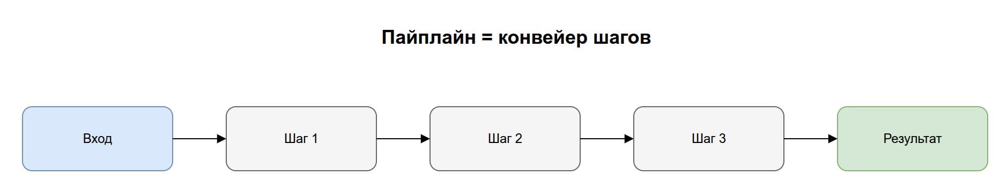
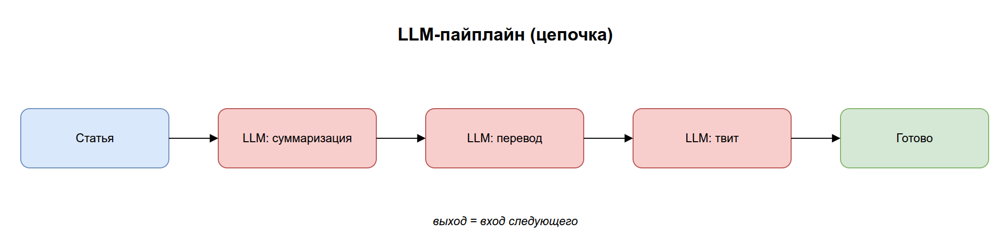
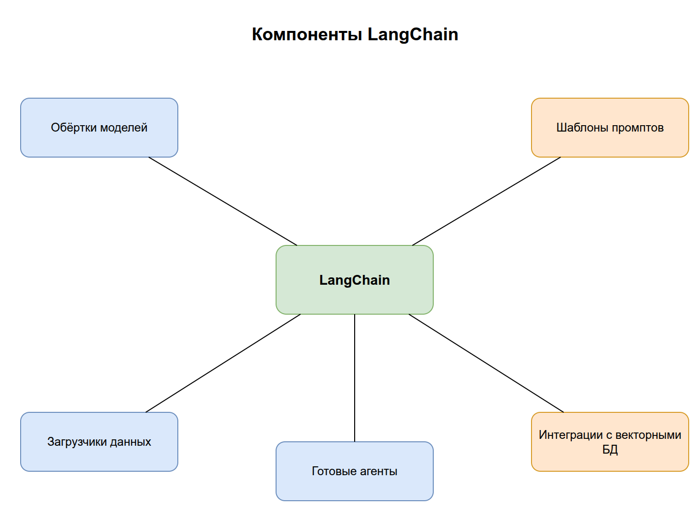
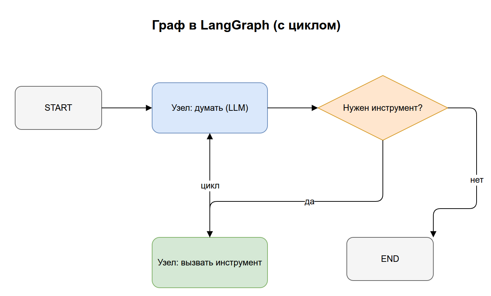
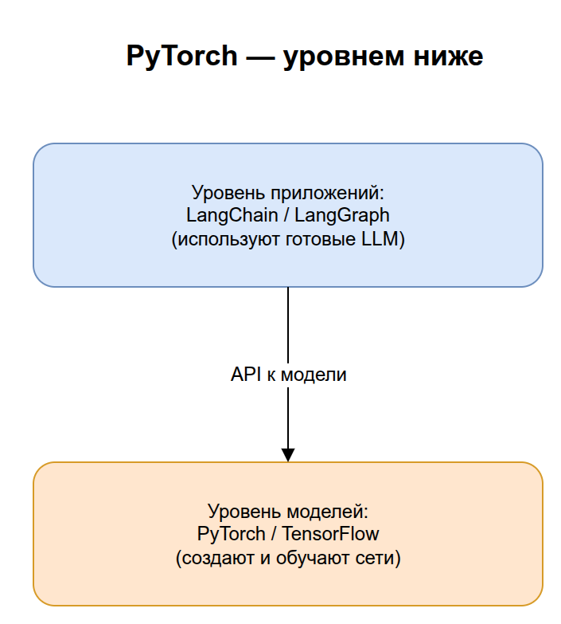
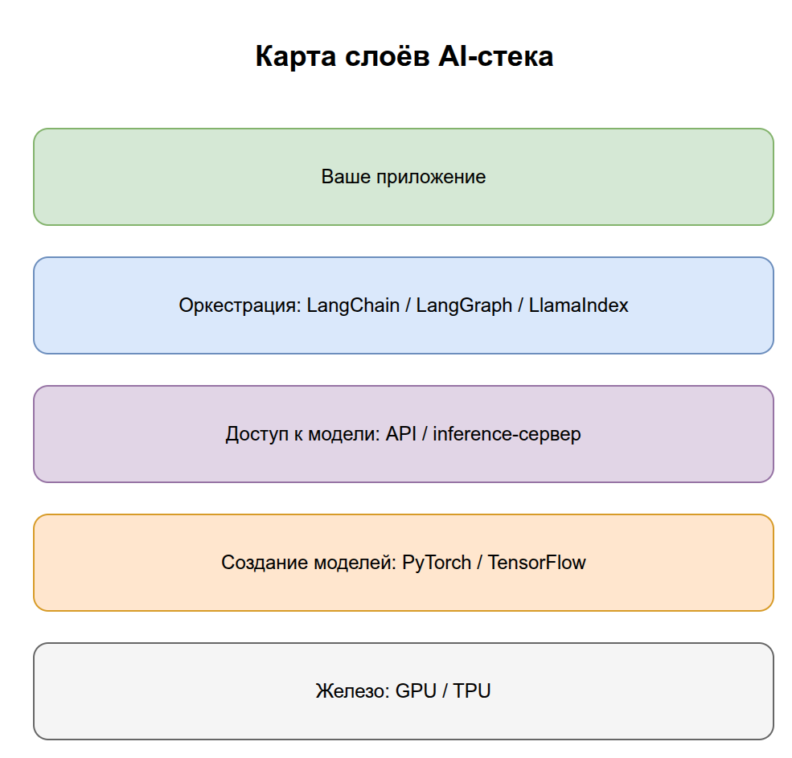
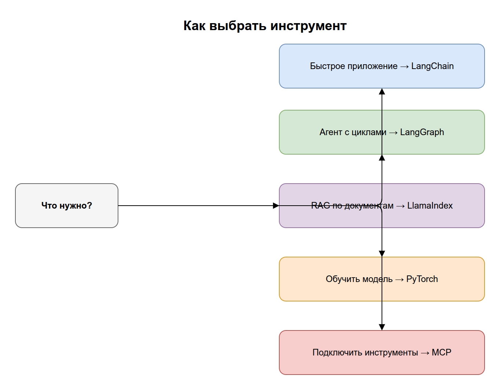

# 05. Пайплайны и фреймворки

Мы разобрали кирпичики: LLM, агенты, инструменты, RAG. Этот раздел — про инструменты, которыми из кирпичиков собирают **работающие системы**: что такое пайплайн, чем отличаются LangChain и LangGraph, и где во всём этом место PyTorch.

Цель раздела: понять, на каком «слое» работает каждый фреймворк и когда какой выбирать.

## Содержание

1. [Что такое пайплайн](#1-что-такое-пайплайн)
2. [LLM-пайплайн и «цепочки» (chains)](#2-llm-пайплайн-и-цепочки-chains)
3. [LangChain](#3-langchain)
4. [LangGraph: когда нужен граф, а не цепочка](#4-langgraph)
5. [LlamaIndex и другие](#5-llamaindex-и-другие)
6. [PyTorch: уровнем ниже](#6-pytorch-уровнем-ниже)
7. [Карта слоёв: что на чём стоит](#7-карта-слоёв-что-на-чём-стоит)
8. [Как выбрать инструмент](#8-как-выбрать-инструмент)
9. [Ключевые термины раздела](#9-ключевые-термины-раздела)

---

## 1. Что такое пайплайн

**Пайплайн (pipeline, конвейер)** — последовательность шагов обработки, где выход одного шага становится входом следующего. Это общий термин из программирования, не специфичный для AI.

```
[Шаг 1] → [Шаг 2] → [Шаг 3] → результат
```

> Аналогия: заводской конвейер. Деталь проходит станки по очереди, каждый что-то делает. В AI «деталь» — это данные/текст, а «станки» — модели и преобразования.

Мы уже видели пайплайн в [разделе 04](../04-rag/README.md): `вопрос → эмбеддинг → поиск → сборка промпта → LLM → ответ`. Это и есть RAG-пайплайн.



> Исходник диаграммы: [`diagrams/05-pipeline-concept.drawio`](../diagrams/05-pipeline-concept.drawio)

---

## 2. LLM-пайплайн и «цепочки» (chains)

**LLM-пайплайн** — конвейер, в котором один или несколько шагов — это вызовы LLM, обвязанные подготовкой входа и обработкой выхода.

Простейший LLM-пайплайн:
```
данные пользователя → подстановка в шаблон промпта → вызов LLM → разбор ответа
```

Когда несколько таких шагов соединяют последовательно, получается **цепочка (chain)**: выход одной LLM становится входом следующей.

> Пример цепочки: `[LLM суммаризирует статью] → [LLM переводит резюме на английский] → [LLM делает из него твит]`. Три вызова, каждый получает результат предыдущего.



> Исходник диаграммы: [`diagrams/05-llm-pipeline.drawio`](../diagrams/05-llm-pipeline.drawio)

Ключевое ограничение цепочки: она **линейна и однонаправленна**. Шаги идут строго по порядку, без ветвлений и возвратов. Как только нужны условия («если ответ плохой — переспроси») или циклы (как в ReAct-агенте из раздела 03), цепочки становится мало — тогда нужен **граф** (см. LangGraph).

---

## 3. LangChain

**LangChain** — самый известный фреймворк (Python и JS) для построения приложений на LLM. Его идея — дать готовые, совместимые между собой компоненты, чтобы не писать всю обвязку с нуля.

Что даёт LangChain:
- **Обёртки над моделями** — единый интерфейс к OpenAI, Anthropic, локальным моделям. Сменить провайдера = поменять одну строку.
- **Шаблоны промптов** — удобная подстановка переменных в промпты.
- **Загрузчики данных и сплиттеры** — готовые инструменты для этапа индексации RAG (раздел 04).
- **Интеграции с векторными БД** — Chroma, Pinecone, Qdrant и др.
- **Готовые цепочки и агенты** — типовые сценарии «из коробки».

```python
# Иллюстративно: простая цепочка на LangChain
from langchain_openai import ChatOpenAI
from langchain_core.prompts import ChatPromptTemplate

prompt = ChatPromptTemplate.from_template("Объясни {тема} простыми словами")
model = ChatOpenAI()

chain = prompt | model          # "|" соединяет шаги в пайплайн
result = chain.invoke({"тема": "что такое RAG"})
```

> На практике: LangChain удобен для быстрого старта и прототипов. Его часто критикуют за избыточные абстракции, но как «швейцарский нож» с интеграциями он остаётся стандартом де-факто. Оператор `|` (pipe) буквально собирает пайплайн из шагов.



> Исходник диаграммы: [`diagrams/05-langchain.drawio`](../diagrams/05-langchain.drawio)

---

## 4. LangGraph

**LangGraph** — библиотека от создателей LangChain для построения **агентов и сложных рабочих процессов в виде графа**. Появилась именно потому, что линейных цепочек не хватает для агентного поведения.

Ключевая разница с цепочкой:

| | Цепочка (chain) | Граф (LangGraph) |
|---|---|---|
| Форма | Прямая линия шагов | Узлы и рёбра, возможны ветвления и циклы |
| Условия | Нет | Есть («если..., то к узлу X») |
| Циклы | Нет | Есть (можно вернуться назад) |
| Для чего | Простые линейные сценарии | Агенты, ReAct-циклы, сложная логика |

В LangGraph приложение описывается как **граф состояний**:
- **узлы (nodes)** — шаги (вызов LLM, вызов инструмента, проверка);
- **рёбра (edges)** — переходы между шагами, в том числе **условные**;
- **состояние (state)** — данные, которые передаются и накапливаются между узлами.

```python
# Иллюстративно: узел + условное ребро в LangGraph
def think(state: dict) -> dict:        # узел = шаг (обновляет состояние)
    state["next"] = "tool" if state["need_tool"] else "end"
    return state


def route(state: dict) -> str:         # условное ребро: куда идти дальше
    return state["next"]               # "tool" → вызвать инструмент, "end" → ответ
```

> Именно так удобно реализовать ReAct-цикл из [раздела 03](../03-agents/README.md#3-цикл-работы-агента-react): узел «думать» → узел «вызвать инструмент» → ребро возвращает назад к «думать», пока задача не решена.



> Исходник диаграммы: [`diagrams/05-langgraph.drawio`](../diagrams/05-langgraph.drawio)

> Как соотносятся: **LangGraph часто используют поверх компонентов LangChain.** LangChain даёт кирпичики (модели, инструменты), LangGraph задаёт логику их соединения с ветвлениями и циклами.

---

## 5. LlamaIndex и другие

- **LlamaIndex** — фреймворк, заточенный именно под **RAG и работу с данными**. Если LangChain — «обо всём», то LlamaIndex силён в индексации, хранении и хитром извлечении документов. Часто выбирают, когда ядро приложения — это поиск по знаниям.
- **Haystack** — ещё один зрелый фреймворк для поисковых и RAG-систем.
- **Semantic Kernel** (Microsoft) — фреймворк для интеграции LLM в приложения, популярен в экосистеме .NET.

> Эти инструменты во многом пересекаются по возможностям; выбор чаще диктуется экосистемой, командой и конкретным акцентом (универсальность vs RAG vs enterprise-интеграция).

---

## 6. PyTorch: уровнем ниже

Все предыдущие фреймворки (LangChain, LangGraph, LlamaIndex) работают на **уровне приложений**: они *используют* уже готовые LLM через API. **PyTorch** живёт на совсем другом, более низком уровне.

**PyTorch** — библиотека для создания и обучения **самих нейросетей** (от Meta). Это инструмент, которым *делают* модели, а не *вызывают* их.

Что даёт PyTorch:
- **Тензоры** — многомерные массивы чисел (обобщение векторов и матриц), основная единица данных в Deep Learning.
- **Автоматическое дифференцирование (autograd)** — сам вычисляет градиенты для backpropagation (вспомните цикл обучения из [раздела 01](../01-foundations/README.md#4-что-значит-обучить-модель)).
- **Работа с GPU** — ускорение вычислений на видеокартах.
- **Строительные блоки нейросетей** — слои, функции активации, оптимизаторы.

```python
# Иллюстративно: один шаг обучения на PyTorch
import torch

prediction = model(x)              # forward pass
loss = loss_fn(prediction, y)      # вычисляем ошибку
loss.backward()                    # autograd считает градиенты (backprop)
optimizer.step()                   # оптимизатор обновляет веса
optimizer.zero_grad()              # сбрасываем градиенты для след. шага
```

> Связь с разделом 01: этот код — буквально тот самый «цикл обучения», но в реальном виде. `loss.backward()` — это backpropagation, `optimizer.step()` — шаг градиентного спуска.

> На практике: большинство разработчиков AI-приложений **никогда не пишут на PyTorch** — они используют готовые LLM через API и фреймворки уровня LangChain. PyTorch нужен тем, кто обучает или дообучает (fine-tuning) сами модели. Альтернатива — TensorFlow от Google.



> Исходник диаграммы: [`diagrams/05-pytorch-level.drawio`](../diagrams/05-pytorch-level.drawio)

---

## 7. Карта слоёв: что на чём стоит

Главное, что стоит унести из раздела, — **на каком слое работает каждый инструмент**:

```
┌─────────────────────────────────────────────────────────┐
│  ВАШЕ ПРИЛОЖЕНИЕ (чат-бот, ассистент, RAG-сервис)        │
├─────────────────────────────────────────────────────────┤
│  ОРКЕСТРАЦИЯ: LangChain, LangGraph, LlamaIndex            │
│  (соединяют LLM, инструменты, RAG в логику)               │
├─────────────────────────────────────────────────────────┤
│  ДОСТУП К МОДЕЛИ: API (OpenAI, Anthropic) или локальный   │
│  inference-сервер                                         │
├─────────────────────────────────────────────────────────┤
│  СОЗДАНИЕ/ОБУЧЕНИЕ МОДЕЛЕЙ: PyTorch, TensorFlow           │
│  (тензоры, обучение, веса)                                │
├─────────────────────────────────────────────────────────┤
│  ЖЕЛЕЗО: GPU / TPU                                        │
└─────────────────────────────────────────────────────────┘
```



> Исходник диаграммы: [`diagrams/05-stack-layers.drawio`](../diagrams/05-stack-layers.drawio)

> Запомнить: **PyTorch — внизу (делают модели), LangChain/LangGraph — наверху (используют модели).** Их часто упоминают вместе, но они решают совершенно разные задачи на разных этажах.

---

## 8. Как выбрать инструмент

Простые ориентиры:

- **Нужно быстро собрать приложение на готовой LLM** → LangChain.
- **Нужен агент с ветвлениями, циклами, сложной логикой** → LangGraph.
- **Ядро приложения — поиск по большим объёмам документов (RAG)** → LlamaIndex (или LangChain).
- **Нужно обучить или дообучить саму модель** → PyTorch (или TensorFlow).
- **Нужно просто подключить инструменты к ассистенту без кода интеграций** → MCP (раздел 03).



> Исходник диаграммы: [`diagrams/05-tool-choice.drawio`](../diagrams/05-tool-choice.drawio)

---

## 9. Ключевые термины раздела

| Термин | Короткое определение | Примеры |
|--------|----------------------|---------|
| **Пайплайн** | Последовательность шагов, где выход одного — вход следующего | Загрузка → чанкинг → эмбеддинг → поиск |
| **LLM-пайплайн** | Пайплайн, где шаги включают вызовы LLM | Извлечь данные → суммировать → перевести |
| **Chain (цепочка)** | Линейная последовательность LLM-шагов | Промпт → LLM → парсер → следующий промпт |
| **LangChain** | Фреймворк с готовыми компонентами для LLM-приложений | Сборка чат-бота с памятью и инструментами |
| **LangGraph** | Библиотека для агентов и процессов в виде графа (с ветвлениями и циклами) | Агент с циклом «думать → действовать» |
| **Узел / ребро / состояние** | Элементы графа в LangGraph | Узел = шаг, ребро = переход, состояние = общие данные |
| **LlamaIndex** | Фреймворк, заточенный под RAG и работу с данными | Индексация документов и запрос к ним |
| **PyTorch** | Библиотека для создания и обучения нейросетей | Обучение своей нейросети с нуля |
| **Тензор** | Многомерный массив чисел — единица данных в Deep Learning | Картинка 224×224×3 как тензор |
| **Autograd** | Автоматическое вычисление градиентов для backpropagation | `loss.backward()` в PyTorch |

---

## 10. Опросник для самопроверки

Финальный опросник: он проверяет не только этот раздел, но и связи со всей базой знаний. Отвечайте своими словами.

### Уровень 1. Понимание определений

1. Что такое пайплайн в общем смысле (одной фразой)? → [§1](#1-что-такое-пайплайн)
2. Что такое chain (цепочка) и чем LLM-пайплайн отличается от обычного? → [§2](#2-llm-пайплайн-и-цепочки-chains)
3. Что даёт LangChain (назовите 2–3 группы компонентов)? → [§3](#3-langchain)
4. Из чего состоит граф в LangGraph (узлы, рёбра, состояние)? → [§4](#4-langgraph)
5. Что такое PyTorch и тензор? → [§6](#6-pytorch-уровнем-ниже)

### Уровень 2. Связи между понятиями

6. Главное ограничение цепочки — почему её не хватает для агента? → [§2](#2-llm-пайплайн-и-цепочки-chains)
7. Чем LangGraph отличается от цепочки (ветвления, циклы)? Как на нём ложится ReAct из раздела 03? → [§4](#4-langgraph)
8. На каком «слое» работает LangChain, а на каком — PyTorch? Кто «делает модели», а кто «использует»? → [§6](#6-pytorch-уровнем-ниже), [§7](#7-карта-слоёв-что-на-чём-стоит)
9. Как код одного шага обучения на PyTorch связан с циклом обучения из раздела 01 (loss.backward, optimizer.step)? → [§6](#6-pytorch-уровнем-ниже)
10. Перечислите слои AI-стека сверху вниз (приложение → ... → железо). → [§7](#7-карта-слоёв-что-на-чём-стоит)

### Уровень 3. Применение

11. Нужно быстро собрать чат-бота на готовой LLM с парой инструментов. Что возьмёте? → [§8](#8-как-выбрать-инструмент)
12. Нужен агент с условиями «если ответ плохой — переспроси» и циклами. Что возьмёте и почему не цепочку? → [§4](#4-langgraph), [§8](#8-как-выбрать-инструмент)
13. Задача — обучить собственную небольшую нейросеть с нуля. Какой инструмент уровня «создания моделей» нужен? → [§6](#6-pytorch-уровнем-ниже)
14. Соберите всю картину: опишите, как LLM (р.02) + инструменты через MCP (р.03) + RAG (р.04) собираются в приложение средствами LangGraph (р.05). На каком слое каждый компонент? → [§7](#7-карта-слоёв-что-на-чём-стоит)

### Как оценить результат

- **12–14 уверенных ответов** (включая итоговый №14) → поздравляю, вся база знаний усвоена. Дальше — практика и глоссарий для повторения.
- **7–11** → повторите §4 (LangGraph) и §7 (карта слоёв) — это ключ к пониманию, что где находится.
- **Меньше 7** → перечитайте раздел; если путаете уровни (что «делает» vs «использует» модели), сфокусируйтесь на §6–§7.

> Что «подтянуть» по темам: 1–2, 6 → пайплайны и цепочки; 3 → LangChain; 4, 7, 12 → LangGraph и графовая логика; 5, 9, 13 → PyTorch и обучение; 8, 10, 11, 14 → карта слоёв и выбор инструмента (главный навык раздела).

---

**Назад:** [← 04. RAG](../04-rag/README.md) &nbsp;|&nbsp; **Справочник:** [06. Глоссарий →](../06-glossary/README.md)

Поздравляю — вы прошли весь путь от нейрона до production-стека. Теперь любой термин из новостей про AI должен ложиться на построенную картину. Для быстрого повторения используйте глоссарий.
