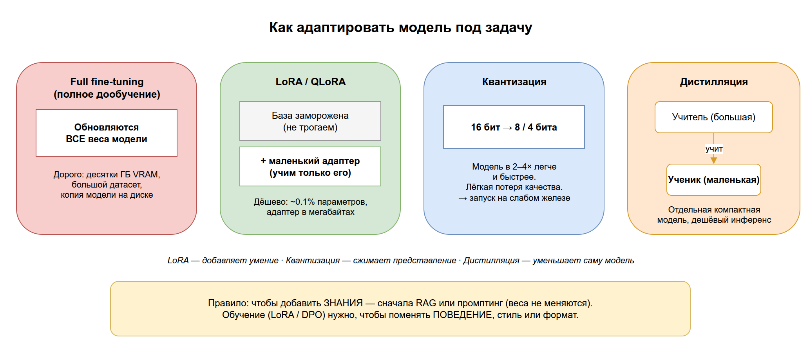

# 06. Адаптация и сжатие моделей

В разделе 02 мы выяснили, что базовую модель **обучают** в несколько этапов (pretraining → fine-tuning → RLHF) и что полное дообучение — дорого: оно меняет все веса модели и требует много данных, GPU и времени.

На практике так почти никто не делает. Этот раздел — про то, как адаптировать и «ужимать» модели дёшево: обучать не всю сеть, а маленькую добавку (**LoRA**), сжимать веса, чтобы модель влезала на слабое железо (**квантизация**), переносить умения большой модели в маленькую (**дистилляция**) и учить модель на человеческих предпочтениях без сложного RLHF (**DPO**). В конце — про то, что всё это служит одной цели: **alignment**, соответствие модели намерениям людей.

Цель раздела: понять, какой приём адаптации выбрать под задачу и бюджет — и почему «дообучить всю модель» почти всегда неправильный первый ответ.

## Содержание

1. [Проблема: полное дообучение слишком дорого](#1-проблема-полное-дообучение-слишком-дорого)
2. [LoRA и QLoRA: дообучать не всё](#2-lora-и-qlora)
3. [Квантизация: сжать веса](#3-квантизация)
4. [Дистилляция: большая модель учит маленькую](#4-дистилляция)
5. [DPO: обучение на предпочтениях без RLHF](#5-dpo)
6. [Alignment: ради чего всё это](#6-alignment)
7. [Как выбрать приём](#7-как-выбрать-приём)
8. [Ключевые термины раздела](#8-ключевые-термины-раздела)
9. [Опросник для самопроверки](#9-опросник-для-самопроверки)

---

## 1. Проблема: полное дообучение слишком дорого

Вспомним из [раздела 02](../02-llm/README.md#7-как-обучают-llm): у современной модели миллиарды весов. **Full fine-tuning (полное дообучение)** обновляет их все. Это означает:

- нужны десятки-сотни гигабайт видеопамяти (хранить не только веса, но и градиенты, и состояния оптимизатора);
- нужен большой размеченный датасет, иначе модель **переобучится** (см. [§5 раздела 01](../01-foundations/README.md#5-что-значит-обучить-модель));
- каждая новая версия — это ещё одна полная копия модели на диске (десятки ГБ).

> Аналогия: чтобы поменять пару фраз в толстой книге, вы перепечатываете её целиком с нуля. Логичнее — вложить между страниц несколько листков с правками.

Именно из этой «боли» выросли приёмы ниже. Их объединяют под зонтиком **PEFT (Parameter-Efficient Fine-Tuning)** — «экономное по параметрам дообучение».



> Исходник диаграммы: [`diagrams/06-finetune-efficient.drawio`](../diagrams/06-finetune-efficient.drawio)

---

## 2. LoRA и QLoRA

**LoRA (Low-Rank Adaptation)** — вместо того чтобы менять все веса, к модели «пристёгивают» маленькие дополнительные матрицы и обучают только их. Исходные веса модели **замораживаются** и не трогаются вовсе.

Почему это работает: изменение, которое нужно внести при дообучении, обычно «простое» (низкоранговое) и хорошо описывается парой маленьких матриц. Их суммарный размер — доли процента от модели.

- Обучаемых параметров становится в сотни-тысячи раз меньше → влезает на одну видеокарту.
- Результат обучения — маленький файл-«адаптер» (мегабайты, а не гигабайты). Одну базовую модель можно держать в памяти, а под разные задачи подгружать разные адаптеры.

**QLoRA** — та же LoRA, но поверх **квантизованной** (сжатой) базовой модели (см. §3). Это позволяет дообучать даже крупные модели на одной потребительской GPU.

```python
# Иллюстративно: обучаем не всю модель, а только LoRA-адаптеры
base_model = load_model("llama-3-8b")   # веса заморожены
base_model.freeze()                      # градиенты по ним не считаем

adapter = LoRA(rank=8, target="attention")  # ~0.1% параметров модели
train(adapter, dataset)                       # учим только адаптер

adapter.save("my-task.lora")            # результат — файл в мегабайтах
```

> На практике: когда говорят «мы зафайнтюнили Llama под свою задачу», в 9 случаях из 10 имеют в виду именно LoRA/QLoRA, а не полное дообучение.

---

## 3. Квантизация

**Квантизация (quantization)** — сжатие модели за счёт снижения точности чисел, которыми записаны её веса. Обычно веса хранятся в 16 битах; квантизация переводит их в 8 или даже 4 бита.

- Модель занимает в 2–4 раза меньше памяти и работает быстрее.
- Плата — небольшая потеря качества (при 8 битах почти незаметна, при 4 — заметнее).

> Аналогия: JPEG для фотографии. Файл резко легчает, а глаз почти не видит разницы — если не пережать слишком сильно.

> На практике: квантизация — это то, что позволяет запускать LLM локально на ноутбуке (форматы вроде GGUF, инструменты Ollama, llama.cpp). Она про **инференс на слабом железе**, тогда как LoRA — про дешёвое **обучение**. Их часто комбинируют (это и есть QLoRA).

---

## 4. Дистилляция

**Дистилляция (distillation)** — большая, мощная модель-«учитель» обучает маленькую модель-«ученика» имитировать свои ответы. Цель — получить компактную модель, которая работает почти как большая, но дешевле и быстрее.

- Ученик учится не только на «правильных ответах», но и на том, *как рассуждает* учитель.
- Результат — отдельная самостоятельная модель меньшего размера (в отличие от LoRA, где адаптер «висит» на большой базе).

> Аналогия: опытный мастер натаскивает подмастерье. Подмастерье не станет точной копией, но переймёт большую часть навыков и будет справляться сам.

> На практике: многие «маленькие, но неожиданно умные» модели — результат дистилляции из более крупных. Это разные оси оптимизации: **дистилляция уменьшает саму модель**, **квантизация сжимает её представление**, **LoRA добавляет умение не трогая базу**.

---

## 5. DPO

Напомним из [раздела 02](../02-llm/README.md#7-как-обучают-llm): **RLHF** учит модель давать ответы, которые нравятся людям, но это сложный многоступенчатый процесс (нужно обучить отдельную «модель вознаграждения» и гонять обучение с подкреплением).

**DPO (Direct Preference Optimization)** — более простая альтернатива. Модель учат напрямую на парах ответов «этот лучше / этот хуже», без отдельной модели вознаграждения и без RL.

- Проще в реализации и стабильнее в обучении, чем классический RLHF.
- Данные те же по сути — человеческие (или модельные) предпочтения между вариантами ответа.

> На практике: DPO во многом вытеснил классический RLHF в открытых проектах именно из-за простоты. И RLHF, и DPO решают одну задачу — **выравнивание** поведения модели с предпочтениями людей (см. §6).

---

## 6. Alignment

Все приёмы этого раздела и весь этап RLHF/DPO служат одной большой цели — **alignment (выравнивание)**: чтобы поведение модели соответствовало намерениям, ценностям и ожиданиям людей.

Модель после pretraining умна, но «дикая»: она просто продолжает текст и не отличает полезное от вредного. Alignment — это про то, чтобы она была:

- **helpful** — реально помогала с задачей;
- **honest** — не выдумывала (см. галлюцинации, [§9 раздела 02](../02-llm/README.md#9-галлюцинации-и-ограничения));
- **harmless** — отказывалась от опасных просьб.

> На практике: alignment — это не одна кнопка, а совокупность обучения (RLHF/DPO), системных промптов и ограничителей на этапе работы. Про защиту уже во время эксплуатации — guardrails, инъекции и джейлбрейки — будет [раздел 08](../08-safety/README.md).

---

## 7. Как выбрать приём

Короткая шпаргалка «задача → приём»:

| Задача | Приём | Почему |
|--------|-------|--------|
| Модель должна отвечать в вашем стиле / формате | **LoRA / QLoRA** | Дёшево, маленький адаптер, база не трогается |
| Запустить модель локально / на слабом железе | **Квантизация** | Меньше памяти и быстрее ценой лёгкой потери качества |
| Нужна своя компактная модель под продакшн | **Дистилляция** | Отдельная маленькая модель, дешёвый инференс |
| Подстроить *поведение*/тон под предпочтения | **DPO** (или RLHF) | Учит на парах «лучше/хуже» без сложного RL |
| Просто добавить свежие/приватные **знания** | **RAG** (раздел 04), не обучение | Не меняет веса вовсе — дешевле и обновляется на лету |

> Ключевое правило: если нужно добавить **знания** — почти всегда сначала пробуйте RAG или промптинг, а не дообучение. Обучение (LoRA/DPO) нужно, когда надо поменять **поведение, стиль или формат**, а не факты.

---

## 8. Ключевые термины раздела

| Термин | Короткое определение | Примеры |
|--------|----------------------|---------|
| **Full fine-tuning** | Полное дообучение — обновляет все веса модели | Дорого: десятки ГБ VRAM, большой датасет |
| **PEFT** | Экономное по параметрам дообучение (зонтичный термин) | LoRA, адаптеры, prefix-tuning |
| **LoRA** | Обучение маленьких добавочных матриц; база заморожена | Адаптер-файл в мегабайтах под конкретную задачу |
| **QLoRA** | LoRA поверх квантизованной модели | Дообучение крупной модели на одной GPU |
| **Квантизация** | Сжатие весов снижением точности чисел (16 → 8/4 бита) | GGUF, запуск LLM локально через Ollama |
| **Дистилляция** | Большая модель-учитель обучает маленькую-ученика | Компактная модель, близкая по качеству к крупной |
| **DPO** | Обучение на парах «ответ лучше/хуже» без отдельной reward-модели | Простая замена классическому RLHF |
| **Alignment** | Выравнивание поведения модели с намерениями людей | helpful, honest, harmless |

---

## 9. Опросник для самопроверки

Отвечайте своими словами, не подсматривая. Ссылки — куда вернуться, если ответ не даётся.

### Уровень 1. Понимание определений

1. Почему полное дообучение (full fine-tuning) дорогое? Назовите хотя бы две причины. → [§1](#1-проблема-полное-дообучение-слишком-дорого)
2. Что обучает LoRA и что при этом происходит с исходными весами модели? → [§2](#2-lora-и-qlora)
3. Что такое квантизация и что она уменьшает? → [§3](#3-квантизация)
4. Чем модель-ученик отличается от модели-учителя при дистилляции? → [§4](#4-дистилляция)
5. Что такое alignment одним предложением? → [§6](#6-alignment)

### Уровень 2. Связи между понятиями

6. Чем LoRA отличается от квантизации по цели (обучение vs инференс)? Что такое QLoRA как их сочетание? → [§2](#2-lora-и-qlora)
7. Дистилляция уменьшает саму модель, квантизация — её представление, LoRA — добавляет умение. Приведите пример, когда какой приём уместен. → [§7](#7-как-выбрать-приём)
8. Чем DPO проще классического RLHF? Какую общую задачу они решают? → [§5](#5-dpo)
9. Как связаны RLHF/DPO и alignment? → [§6](#6-alignment)

### Уровень 3. Применение

10. Нужно, чтобы модель отвечала в фирменном стиле компании. Знания менять не надо. Что выберете и почему не RAG? → [§7](#7-как-выбрать-приём)
11. Модель на 13B не влезает в вашу видеокарту. Каким приёмом уместиться и что вы потеряете? → [§3](#3-квантизация)
12. Вам надо просто добавить свежие внутренние документы в ответы бота. Стоит ли дообучать модель? Что лучше? → [§7](#7-как-выбрать-приём)

### Как оценить результат

- **10–12 уверенных ответов** → отлично, переходите к разделу 07.
- **6–9** → повторите §2 (LoRA), §3 (квантизация) и §7 (как выбрать) — это практическое ядро раздела.
- **Меньше 6** → перечитайте раздел; если путается «обучение vs добавление знаний», вернитесь к §7 и к [§7 раздела 02](../02-llm/README.md#7-как-обучают-llm).

> Что «подтянуть» по темам: 1 → стоимость обучения; 2, 6, 10 → LoRA/QLoRA; 3, 11 → квантизация; 4, 7 → дистилляция; 5, 8, 9 → DPO и alignment; 12 → выбор между обучением и RAG.

---

**Назад:** [← 05. Пайплайны и фреймворки](../05-pipelines-frameworks/README.md) &nbsp;|&nbsp; **Дальше:** [07. Инференс и производительность →](../07-inference/README.md)

> Дальше: модель обучена и ужата — но как она отвечает *быстро*? В разделе 07 разберём инференс: KV cache, стриминг, батчинг и от чего зависит задержка.
