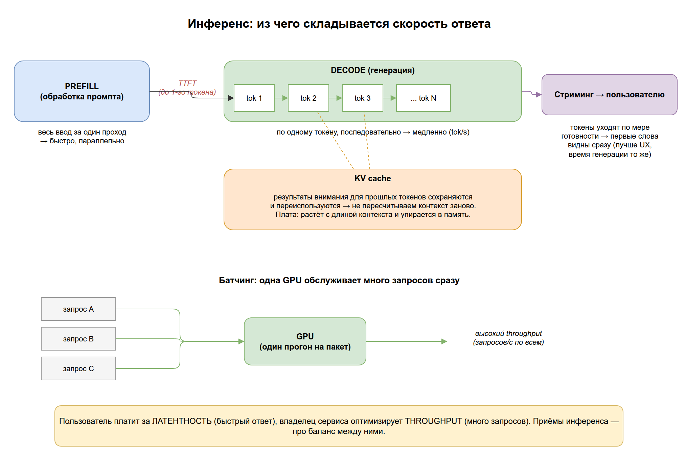

# 07. Инференс и производительность

В [разделе 01](../01-foundations/README.md#6-inference-использование-обученной-модели) мы ввели **инференс** — использование уже обученной модели для генерации ответа. В [разделе 06](../06-model-adaptation/README.md) научились делать модель легче. Теперь разберём вторую половину вопроса: как заставить её отвечать **быстро** и обслуживать **много** пользователей.

Это важно, потому что «модель работает» и «модель работает в продакшне» — разные вещи. Пользователь чувствует не качество весов, а **задержку**: как быстро побежали первые слова и с какой скоростью идёт остальной текст. А владелец сервиса считает **пропускную способность**: сколько запросов в секунду выдерживает одна дорогая видеокарта.

Цель раздела: понять, из чего складывается скорость ответа LLM и какие приёмы (KV cache, батчинг, стриминг) на неё влияют — чтобы осмысленно читать бенчмарки и не удивляться, почему «та же модель» у разных провайдеров отвечает по-разному.

## Содержание

1. [Почему инференс LLM медленный](#1-почему-инференс-llm-медленный)
2. [Латентность и пропускная способность](#2-латентность-и-пропускная-способность)
3. [KV cache: не пересчитывать прошлое](#3-kv-cache)
4. [Батчинг: обслуживать много запросов сразу](#4-батчинг)
5. [Стриминг: отдавать ответ по мере генерации](#5-стриминг)
6. [Что со всем этим делать на практике](#6-что-со-всем-этим-делать-на-практике)
7. [Ключевые термины раздела](#7-ключевые-термины-раздела)
8. [Опросник для самопроверки](#8-опросник-для-самопроверки)

---

## 1. Почему инференс LLM медленный

Вспомним [авторегрессию из раздела 02](../02-llm/README.md#5-как-llm-генерирует-ответ): модель генерирует ответ **по одному токену за раз**, каждый раз подавая уже сгенерированное обратно на вход.

Это значит, что ответ из 500 токенов — это 500 последовательных «прогонов» модели, которые **нельзя распараллелить между собой**: чтобы предсказать 200-й токен, нужен 199-й. Отсюда фундаментальное ограничение: длинный ответ физически не может появиться мгновенно.

Инференс принято делить на две фазы:

- **Prefill (обработка промпта).** Модель за один проход «прочитывает» весь ваш ввод. Это быстро и хорошо параллелится.
- **Decode (генерация).** Модель выдаёт ответ токен за токеном. Это и есть медленная последовательная часть.

> Аналогия: прочитать вопрос целиком можно одним взглядом (prefill), а вот писать ответ приходится буква за буквой ручкой (decode) — здесь и уходит время.

---

## 2. Латентность и пропускная способность

Две главные метрики производительности, которые важно не путать:

- **Латентность (latency)** — задержка *одного* запроса. У LLM её разбивают на:
  - **TTFT (Time To First Token)** — сколько ждать *первого* токена (зависит от prefill и длины промпта);
  - **TPOT / скорость генерации** — сколько токенов в секунду идёт дальше (обычно измеряют в tok/s).
- **Пропускная способность (throughput)** — сколько запросов/токенов в секунду система обрабатывает суммарно по *всем* пользователям.

> Ключевой момент: латентность и throughput часто **конфликтуют**. Можно ускорить одного пользователя (низкая латентность) или обслужить максимум пользователей на той же GPU (высокий throughput) — но не всегда одновременно. Приёмы ниже — про то, как балансировать этот компромисс.

> На практике: когда провайдер обещает «X токенов в секунду», уточняйте — это про одного пользователя (латентность) или про загруженный сервер (throughput). Это разные числа.

---

## 3. KV cache

Самая важная оптимизация инференса. Вспомним [attention из раздела 02](../02-llm/README.md#4-трансформер-и-механизм-внимания): чтобы предсказать новый токен, модель учитывает все предыдущие. Наивно — на каждом шаге пришлось бы заново пересчитывать представления *всех* прошлых токенов. Для 500-го токена это 500-кратная работа впустую.

**KV cache (кэш ключей и значений)** решает это: промежуточные результаты внимания для уже обработанных токенов **сохраняются** и переиспользуются. На каждом новом шаге модель считает только новый токен, а прошлое берёт из кэша.

- Без KV cache генерация была бы квадратично медленной по длине.
- Плата — **память**: кэш растёт с длиной контекста и числом одновременных запросов. Часто именно KV cache, а не сами веса, упирается в лимит видеопамяти при длинных диалогах.

> Аналогия: решая пример в столбик, вы не пересчитываете предыдущие разряды заново на каждом шаге — вы держите промежуточные суммы «в уме». KV cache — это «в уме» для модели.



> Исходник диаграммы: [`diagrams/07-inference-speed.drawio`](../diagrams/07-inference-speed.drawio)

---

## 4. Батчинг

Видеокарта эффективна, когда считает **много данных параллельно**. Обрабатывать запросы по одному — значит держать дорогую GPU почти простаивающей.

**Батчинг (batching)** — объединение нескольких запросов в один «пакет», который модель прогоняет вместе. Так одна GPU обслуживает десятки пользователей почти без потери скорости для каждого.

Проблема: у пользователей запросы приходят в разное время и имеют разную длину. Ждать, пока наберётся полный пакет, — добавлять латентность. Решение, которое используют современные серверы инференса, — **continuous batching (непрерывный батчинг)**: запросы добавляются в пакет и покидают его на лету, как только закончили генерацию, не дожидаясь остальных.

> На практике: continuous batching — главная причина, по которой облачные API дёшевы. Именно он превращает высокую латентность отдельного запроса в высокий общий throughput. Библиотеки вроде vLLM и TGI построены вокруг этой идеи.

---

## 5. Стриминг

**Стриминг (streaming)** — отдача ответа пользователю **по мере генерации**, токен за токеном, а не целиком в самом конце.

Стриминг не делает модель быстрее — общее время генерации то же. Но он резко улучшает *воспринимаемую* скорость: первые слова появляются почти сразу (после TTFT), и пользователь начинает читать, пока хвост ещё генерируется.

- Именно поэтому в ChatGPT, Claude и других чатах текст «печатается» на глазах.
- Технически ответ приходит потоком по мере готовности токенов (обычно через SSE или WebSocket).

```python
# Иллюстративно: без стриминга ждём весь ответ; со стримингом — печатаем на лету
for token in model.stream("Объясни, что такое инференс"):
    print(token, end="", flush=True)   # токены появляются по одному
```

> На практике: стриминг — почти бесплатный способ улучшить UX. Он не трогает throughput сервера, но делает ожидание психологически комфортным. Для не-интерактивных задач (пакетная обработка, извлечение данных) он не нужен.

---

## 6. Что со всем этим делать на практике

Короткая карта «приём → на что влияет»:

| Приём | Что улучшает | Цена / нюанс |
|-------|--------------|--------------|
| **KV cache** | Скорость генерации (обязателен) | Ест память, растёт с длиной контекста |
| **Батчинг** (continuous) | Throughput сервера | Сам по себе не ускоряет одного пользователя |
| **Стриминг** | *Воспринимаемую* латентность (TTFT) | Не меняет общее время и throughput |
| **Квантизация** ([раздел 06](../06-model-adaptation/README.md#3-квантизация)) | Скорость и объём памяти | Лёгкая потеря качества |

Как это связывается воедино:

- Если жалуются «долго ждать первых слов» → проблема в **TTFT** (длинный промпт/prefill), помогает стриминг и более короткий контекст.
- Если «текст печатается медленно» → низкая скорость **decode**, помогают квантизация и более быстрое железо.
- Если «сервис не тянет нагрузку» → упор в **throughput**, помогает батчинг.

> Главный вывод: пользователь платит за латентность, а владелец сервиса оптимизирует throughput. Большинство приёмов инференса — это управление балансом между этими двумя величинами.

---

## 7. Ключевые термины раздела

| Термин | Короткое определение | Примеры |
|--------|----------------------|---------|
| **Prefill** | Фаза обработки всего промпта за один проход | Быстрая, хорошо параллелится |
| **Decode** | Фаза генерации ответа по одному токену | Медленная последовательная часть |
| **Латентность** | Задержка одного запроса | TTFT + скорость генерации (tok/s) |
| **TTFT** | Time To First Token — время до первого токена | Важно для ощущения «отзывчивости» |
| **Throughput** | Пропускная способность: запросов/токенов в секунду по всем | Метрика загруженного сервера |
| **KV cache** | Кэш промежуточных результатов внимания для прошлых токенов | Не пересчитывать контекст на каждом шаге |
| **Батчинг** | Объединение запросов в пакет для параллельной обработки | Continuous batching в vLLM, TGI |
| **Стриминг** | Отдача ответа токен за токеном по мере генерации | «Печатающийся» ответ в чат-ботах |

---

## 8. Опросник для самопроверки

Отвечайте своими словами, не подсматривая. Ссылки — куда вернуться, если ответ не даётся.

### Уровень 1. Понимание определений

1. Почему длинный ответ LLM нельзя сгенерировать мгновенно? Как это связано с авторегрессией? → [§1](#1-почему-инференс-llm-медленный)
2. Чем латентность отличается от пропускной способности (throughput)? → [§2](#2-латентность-и-пропускная-способность)
3. Что кэширует KV cache и зачем? → [§3](#3-kv-cache)
4. Что такое стриминг и делает ли он модель быстрее? → [§5](#5-стриминг)

### Уровень 2. Связи между понятиями

5. Что такое TTFT и на какую фазу инференса (prefill/decode) он в первую очередь опирается? → [§2](#2-латентность-и-пропускная-способность)
6. Почему латентность и throughput часто конфликтуют? Какой приём жертвует первым ради второго? → [§4](#4-батчинг)
7. Почему KV cache при длинном диалоге может упереться в память раньше, чем сами веса модели? → [§3](#3-kv-cache)
8. Как стриминг улучшает *воспринимаемую* скорость, не меняя реального времени генерации? → [§5](#5-стриминг)

### Уровень 3. Применение

9. Пользователь жалуется: «первое слово появляется через 5 секунд». Какая метрика страдает и что попробуете? → [§6](#6-что-со-всем-этим-делать-на-практике)
10. Ваш сервис не выдерживает нагрузку в час пик, хотя каждый ответ быстрый. Куда смотреть? → [§6](#6-что-со-всем-этим-делать-на-практике)
11. Почему облачные API так дёшевы за токен по сравнению с запуском модели «на один запрос»? → [§4](#4-батчинг)

### Как оценить результат

- **9–11 уверенных ответов** → отлично, переходите к разделу 08.
- **5–8** → повторите §2 (метрики), §3 (KV cache) и §4 (батчинг) — это ядро производительности.
- **Меньше 5** → перечитайте раздел; если путается «латентность vs throughput» (§2), вернитесь к нему прежде всего — на нём держится вся глава.

> Что «подтянуть» по темам: 1 → авторегрессия и фазы инференса; 2, 5 → метрики и TTFT; 3, 7 → KV cache; 4, 6, 10, 11 → батчинг и throughput; 8, 9 → стриминг и латентность.

---

**Назад:** [← 06. Адаптация и сжатие моделей](../06-model-adaptation/README.md) &nbsp;|&nbsp; **Дальше:** [08. Безопасность и надёжность →](../08-safety/README.md)

> Дальше: модель обучена, ужата и отвечает быстро — но можно ли ей доверять? В разделе 08 разберём guardrails, prompt injection, jailbreak и оценку качества (evals).
